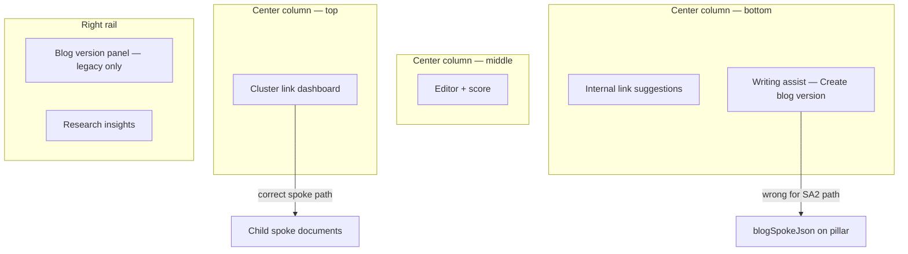
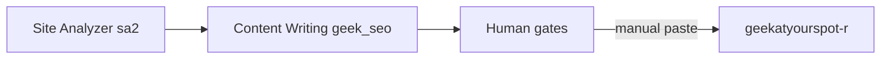

# Handoff — Content Writing

**Status:** Operator + engineering reference  
**Last updated:** 2026-06-30  
**Honest summary:** Content Writing works, but the UI stacks **three different “blog/spoke/link” systems** on one page. That is confusing even before social posts enter the picture. This doc names each system, says which one to use, and lists known traps.

---

## TL;DR — what to use today

If you opened Content Writing from **Site Analyzer** (`analysisRunId` on the document):

1. Edit the **pillar** draft in the center editor (four-phase H2 structure + closing FAQ).
2. Use **Cluster link dashboard** at the top — **only** this path for hub-and-spoke linking.
3. **Ignore** “Create blog version” at the bottom of the editor.
4. **Ignore** the right-rail “Blog version” panel — it is hidden for research-backed docs anyway; the bottom button is the trap.
5. Publish is still **manual paste** into **geekatyourspot-r** (see [Publish handoff](#publish-handoff-geekatyourspot-r-not-in-geek-seo)).

```text
Site Analyzer (research ready)
    → Open Content Writer (?analysisRunId=…)
    → Pillar draft auto-generated
    → Cluster: Build plan → Create spokes → Generate spokes
    → Generate linked FAQs → Apply body links
    → Human edit → copy HTML to geekatyourspot-r
```

Social posts are **not** produced in Geek SEO today — they live in geekatyourspot-r’s `SocialPost` catalog and CI lint. See [What Geek SEO does not own](#what-geek-seo-does-not-own-yet).

---

## How you arrive here

### Primary path (research-backed pillar)

```text
/content-writing?analysisRunId=<analysis_runs.Id>
```

| Step | What happens |
|------|----------------|
| 1 | Geek SEO validates the run — **SA2 mode:** full `ResearchBackedWriteGate`; **manual mode:** `ValidateManualResearchExport` (keyword + supplemental lanes). |
| 2 | Creates or opens `seo_content_documents` with `analysisRunId` set. |
| 3 | Runs research-backed draft job (frozen `sa2` data — not copied JSON on the document). |
| 4 | Redirects to `/content-writing?documentId=<uuid>`. |

Research stays in **`sa2`**. The document only stores a pointer (`analysisRunId`) plus writer-owned fields (HTML, scores, cluster plan JSON, etc.).

See: [`docs/site-analyzer/HANDOFF.md`](../site-analyzer/HANDOFF.md) · [`MANUAL-FIVE-LANE-RESEARCH.md`](../site-analyzer/MANUAL-FIVE-LANE-RESEARCH.md) (pilot path)

### Secondary path (legacy / standalone)

Documents **without** `analysisRunId` can still be created from the app (older flows). Those docs:

- Show **Blog version** in the right rail (`BlogSpokePanel`).
- Do **not** show **Cluster link dashboard** (requires `analysisRunId`).
- Can refresh live SERP benchmarks (research-backed docs use frozen research instead).

Treat standalone as legacy unless you are explicitly testing old behavior.

---

## Page layout (what is where)

Three-column workspace when a document is open:

| Zone | Location | Purpose |
|------|----------|---------|
| **Cluster link dashboard** | Top of center column | Hub-and-spoke plan, spokes, FAQ/body link apply — **research-backed pillars only** |
| **Editor** | Center column | Title, keyword, TipTap HTML, save, score |
| **Internal link suggestions** | Below editor | Project-wide link ideas (pillar ↔ spoke ↔ sibling) — **not** the cluster plan |
| **Writing assist** | Bottom of editor | Humanize + **Create blog version** (legacy blog JSON — see traps) |
| **Score sidebar** | Left rail | Live content score |
| **Insights rail** | Right rail | Guidelines, JSON-LD, research insights (`analysisRunId`), optional Blog version panel |



---

## The confusion: three parallel “spoke” systems

This is the root cause of “I built a plan but links don’t work” and “why is there Create blog at the bottom?”

| # | Name | UI entry | Storage | Feeds cluster FAQ/body links? | When to use |
|---|------|----------|---------|-------------------------------|-------------|
| **A** | **Cluster spokes** | Cluster dashboard → Create spoke → Generate spoke | Separate `seo_content_documents` (`documentKind: spoke`, `parentDocumentId`) | **Yes** | **Always** for Site Analyzer handoffs |
| **B** | **Blog version** | Right rail *or* bottom “Create blog version” | `blogSpokeJson` column on the **pillar** document | **No** | Legacy standalone only; avoid for SA2 |
| **C** | **Internal link suggestions** | Panel below editor | Ephemeral suggestions from `InternalLinkService` | **No** (manual insert) | Optional polish; not the cluster workflow |

Systems **A** and **B** both generate blog-like content. Only **A** participates in:

- `Generate linked FAQs`
- `Apply body links`
- `links ready` counts on the cluster dashboard

### Trap: bottom “Create blog version”

`EditorAiToolbar` always shows **Create blog version**, including on research-backed pillars.

- It calls `POST …/blog-spoke/generate` → writes **`blogSpokeJson`** on the pillar.
- It does **not** create cluster child documents (unless a separate migrator runs later).
- The right-rail panel with spoke type / keyword is **hidden** when `analysisRunId` is set — so the bottom button looks like the only blog action, but it is the **wrong** one for SA2.

**Rule:** For `analysisRunId` documents, treat bottom “Create blog version” as a bug/legacy affordance — do not click it.

---

## Document kinds

| `documentKind` | Meaning | Cluster dashboard | Typical URL path |
|----------------|---------|-------------------|------------------|
| `pillar` | Main use-case article | Shown when `analysisRunId` set | `/use-cases/…` on site |
| `spoke` | Cluster child blog | Hidden (open pillar instead) | `/blog/{publishSlug}` |
| `standalone` | Legacy one-off | Hidden | Varies |

Spoke documents show **SpokePillarBanner** with a link back to the parent pillar. Shell spokes (placeholder HTML) must be **generated** before cluster linking treats them as ready.

**Generated spoke** (`SpokeStatusResolver.IsBodyGenerated`):

- `status === body_generated`, **or**
- `wordCount > 80` and HTML does not contain `Spoke draft shell`

Until then, FAQ/body link slots show as pending and apply actions may report **0 inserted, N pending**.

---

## Canonical workflow — research-backed pillar

### Phase 0 — prerequisites (Site Analyzer)

Do not open Content Writer until Site Analyzer shows **Research ready** for the keyword run.

Gates: SERP import, target crawl, competitor crawl, comparison findings, gap topics.  
See [`docs/site-analyzer/HANDOFF.md`](../site-analyzer/HANDOFF.md) · `OperatorResearchService.GetResearchFocusAsync`.

### Phase 1 — pillar draft

1. Open from Site Analyzer → draft job runs automatically on first handoff.
2. Verify pillar structure:
   - **Four methodology H2 sections** (not competitor-title mirroring).
   - **Closing FAQ:** `<h2>Frequently Asked Questions</h2>` + exactly **5** `<h3>` Q&A pairs.
3. Edit title/keyword only if intentional; frozen SERP keyword is on `serpKeyword`.
4. Use left/right rails for score, guidelines, JSON-LD, research insights.

Regenerating an old pillar after methodology fixes does **not** happen automatically — re-run draft or repair manually.

### Phase 2 — cluster plan

On **Cluster link dashboard**:

1. **Build plan** — derives spoke candidates from PAA/PASF, FAQ slots, body link slots (`ContentClusterLinkPlanner`).
2. Review tabs: Overview · Spokes · Links · Research (filtered-out candidates).
3. **Save plan** if you edited FAQ or body slots manually.

Building a plan does **not** create spoke documents — only candidates and link slots.

### Phase 3 — spokes (required before links)

For each candidate (or bulk):

1. **Create spoke shell** — empty child document with slug/title.
2. **Generate spoke** — full 800–1,200 word article (`generateContentSpoke`).
   - Or **Generate all spokes** for remaining shells.

Check **Links ready** stat — it only counts slots whose target spoke is **generated**.

### Phase 4 — apply links to pillar

1. **Generate linked FAQs** — rewrites closing FAQ answers with links to generated spokes where planned.
2. **Apply body links** — inserts contextual links after planned H2 sections.

Both mutate **pillar `contentHtml`**. Save is automatic via reload after apply.

**Soft failure:** Success toast with `0 inserted, N pending` means spokes are still shells — go back to Phase 3.

### Phase 5 — human gate + publish

1. Final human edit (brand, accuracy, summaries if captured elsewhere).
2. Copy/export HTML and metadata for geekatyourspot-r paste.
3. Run geekatyourspot build gates before deploy.

---

## Operator checklist (printable)

**Before Content Writing**

- [ ] Site Analyzer: Research ready for this `analysisRunId`
- [ ] `site_profiles.GeekSeoProjectId` matches Geek SEO project

**Pillar**

- [ ] Draft has four methodology H2s (not 15 competitor headings)
- [ ] Closing FAQ: 5 questions present
- [ ] Content score / guidelines reviewed

**Cluster (do not skip)**

- [ ] Build plan
- [ ] Create spoke shells for chosen candidates
- [ ] **Generate** every spoke you want linked (shells are not enough)
- [ ] Links ready &gt; 0
- [ ] Generate linked FAQs
- [ ] Apply body links
- [ ] Re-read pillar HTML — links visible in FAQ and body

**Do not**

- [ ] Click **Create blog version** at bottom (legacy `blogSpokeJson` path)
- [ ] Assume Internal link suggestions replaced cluster apply
- [ ] Expect social copy from this UI

**Publish**

- [ ] Paste pillar + spokes into geekatyourspot-r catalogs
- [ ] `homeSummary` / `hubSummary` / `metaDescription` distinct (human-approved in target repo)
- [ ] geekatyourspot `next build` passes validate + keyword-registry gates

---

## Failure modes (why links “don’t work”)

| Symptom | Likely cause | Fix |
|---------|--------------|-----|
| Cluster dashboard missing | No `analysisRunId` or document is a spoke | Open pillar from SA2 handoff |
| Links ready = 0 | Spokes are shells, not generated | Generate spoke content |
| Apply body links: “N pending” | `IsBodyGenerated` false for target slugs | Generate those spokes |
| FAQ links missing | Plan not saved / FAQs not generated | Save plan → Generate linked FAQs |
| Body links missing | No matching H2 hint in pillar HTML | Ensure methodology H2 text matches plan hints |
| Used bottom Create blog | Created `blogSpokeJson` only | Ignore; use cluster spokes instead |
| Opened spoke, expected cluster UI | Dashboard only on pillar | Use banner link to parent pillar |

---

## Pillar article structure (four-phase methodology)

Research-backed drafts follow **writing methodology phases** (e.g. Business Objectives → Data Quality → Choose AI → Implementation), **not** competitor SERP titles as H2s.

| Layer | Rule |
|-------|------|
| H1 | Once — article title |
| Body H2s | Exactly **one per methodology phase** (`ArticleMethodologyScaffold`) |
| Subtopics | Competitor/SERP items inform **content under** phases, not extra H2 clones |
| Closing FAQ | Exactly **5** Q&A pairs under `Frequently Asked Questions` |

Prompt/enforcement: `ArticlePromptBuilder`, `ArticleMethodologyScaffold`, `MethodologySectionHintBuilder`.

### Business voice pack (gated on research drafts)

After methodology repair, `BusinessVoiceDraftEnricher` enforces site-specific voice from the frozen site profile:

| Gate | Requirement |
|------|-------------|
| **Concrete examples** | ≥3 named tools/systems (Shopify, HubSpot, Postgres, etc.) — not abstract “insights” |
| **Traditional vs. AI** | Explicit old-way vs. live-data contrast in **Data Quality Assessment** |
| **Capability bridge** | Paragraph tying topic to what the business builds (chatbots, React apps, automation) when profile declares those capabilities |
| **Topic CTA** | Required paragraph before FAQ — e.g. “Want to see what {keyword} looks like for your stack? Book a free strategy call.” |

Code: `BusinessVoicePackBuilder`, `BusinessVoiceValidator`, `BusinessVoiceDraftEnricher`. PAA filtering: `SerpQuestionFilter`.

Product rules: [`plan-documents/content-writing-prompt.md`](../../plan-documents/content-writing-prompt.md)

---

## Publish handoff (geekatyourspot-r, not in Geek SEO)

Geek SEO **produces** drafts; **geekatyourspot-r** **publishes** after human paste.

| Asset | Geek SEO today | geekatyourspot-r target |
|-------|----------------|-------------------------|
| Pillar HTML + 5 FAQs | Editor + JSON-LD panel | `data/use-cases/{dept}/pages/…` |
| Blog spokes (cluster) | Child documents `/blog/{slug}` | `data/blog/posts/{slug}.ts` + catalog |
| `homeSummary` / `hubSummary` / `metaDescription` | Planned export — not fully in UI | Department catalog fields |
| Social posts | **Not in Geek SEO** | `SocialPost` + `validate-social.ts` |

Planned export contract: [`plan-documents/CONTENT-WRITER-MARKETING-EXPORT.md`](../../plan-documents/CONTENT-WRITER-MARKETING-EXPORT.md)

Two-repo model:



---

## What Geek SEO does not own (yet)

| Capability | Where it lives | Notes |
|------------|----------------|-------|
| **Social posts** | geekatyourspot-r | `SocialPost`, platform copy, `linkTargets[]`, CI lint — separate from blog spokes |
| **Validated marketing export bundle** | Planned | Five assets + distinct summaries — see CONTENT-WRITER-MARKETING-EXPORT |
| **CMS / auto-deploy** | Out of scope v1 | Manual paste at current volume |
| **Live SERP refresh** | Disabled when `analysisRunId` set | Research is frozen at handoff time |

Adding social to Content Writing would be a **fourth** deliverable track — do not conflate with cluster blog spokes or legacy blog version.

---

## UX / product debt (fix list)

These are known sources of operator confusion:

1. **Hide or relabel** bottom **Create blog version** when `analysisRunId` is set; point to Cluster dashboard.
2. **Block Apply links** until `links ready > 0` with explicit checklist (not soft success).
3. **Auto-create spoke shells** on Build plan (optional) to reduce shell-vs-generated gap.
4. **Unify** legacy `blogSpokeJson` path into cluster child documents or remove for SA2.
5. **Scroll/highlight** pillar after link insert so changes are visible.
6. **Export panel** for geekatyourspot paste map (pillar + N spokes + summaries).
7. **Social** — product decision: new deliverable type in Geek SEO vs keep geekatyourspot-r-only.

---

## API / data map (engineering)

| Concern | Primary types / services |
|---------|--------------------------|
| Handoff validation | `ContentWriterHandoffService` |
| Document CRUD | `IContentDocumentService`, `seo_content_documents` |
| Cluster plan | `ContentClusterPlanService`, `ContentClusterLinkPlanner`, `clusterLinkPlanJson` |
| Spoke CRUD + generate | `ContentSpokeService` |
| FAQ link apply | `ContentLinkedFaqService` |
| Body link apply | `ContentBodyLinkService`, `ContentBodyLinkInserter` |
| Link readiness | `SpokeStatusResolver` |
| Legacy blog JSON | `ContentBlogSpokeService`, `blogSpokeJson` |
| Ad-hoc suggestions | `InternalLinkService` |
| Research read | `sa2` via `analysisRunId` (not document JSON snapshots) |

### Frontend entry points

| File | Role |
|------|------|
| `frontend/src/app/content-writing/page.tsx` | Route, handoff gate, layout |
| `frontend/src/components/content-writing/cluster-plan-panel.tsx` | Cluster dashboard |
| `frontend/src/components/content-writing/blog-spoke-panel.tsx` | Legacy blog version (right rail) |
| `frontend/src/components/editor/editor-ai-toolbar.tsx` | Bottom Create blog version |
| `frontend/src/components/editor/internal-links-panel.tsx` | Suggestion list |
| `frontend/src/components/content-writing/review-workspace-context.tsx` | Workspace shell, conditional panels |

---

## Related docs

| Doc | Topic |
|-----|-------|
| [`docs/site-analyzer/HANDOFF.md`](../site-analyzer/HANDOFF.md) | `analysisRunId` handoff, research gates |
| [`docs/site-analyzer/OPERATOR-WORKFLOW.md`](../site-analyzer/OPERATOR-WORKFLOW.md) | Full SA2 operator sequence |
| [`plan-documents/CONTENT-WRITER-MARKETING-EXPORT.md`](../../plan-documents/CONTENT-WRITER-MARKETING-EXPORT.md) | Five-asset export + geekatyourspot paste |
| [`plan-documents/content-writing-prompt.md`](../../plan-documents/content-writing-prompt.md) | Article structure rules |
| [`frontend/src/components/content-writing/CLAUDE.md`](../../frontend/src/components/content-writing/CLAUDE.md) | Component inventory (dev) |

---

## One-sentence version

**Content Writing is one pillar editor plus a cluster linker on top; ignore the bottom “Create blog version,” finish generating cluster spokes before applying links, and paste the result into geekatyourspot-r — social is a different repo entirely.**
