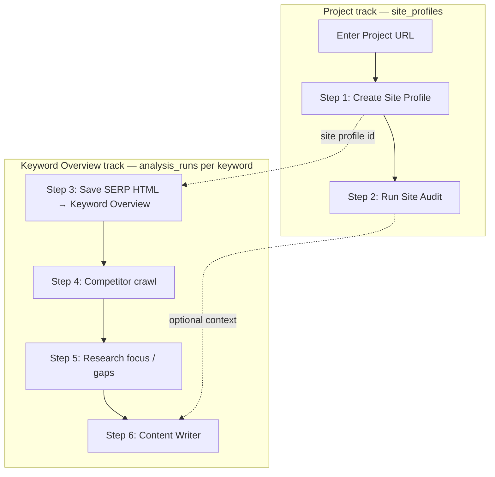
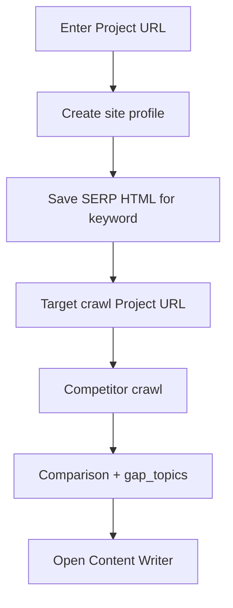

# Operator workflow

Web UI: [site-analyzer.geekatyourspot.com](https://site-analyzer.geekatyourspot.com)

Script: `./scripts/import-serp-html.sh` (keyword lane; `--lane` for supplemental — see [MANUAL-FIVE-LANE-RESEARCH.md](MANUAL-FIVE-LANE-RESEARCH.md)).

## Two keyword tracks

| Track | Gates | When to use |
|-------|-------|-------------|
| **SA2 crawl** (steps 3–8 below) | Competitor crawl + gap topics + target headings | Production keyword overview |
| **Manual five-lane** | Keyword + supplemental HTML lanes only | Pilot topics (e.g. customer-journey) — [MANUAL-FIVE-LANE-RESEARCH.md](MANUAL-FIVE-LANE-RESEARCH.md) |

Both persist to `sa2` on the same `analysisRunId`. `research_mode` on the run selects the Content Writer gate.

## Concepts

| Term | Meaning |
|------|---------|
| **Geek-SEO project** | Client engagement container (Semrush Project); UUID in `site_profiles.geek_seo_project_id` |
| **Project URL** | Client site under analysis (`site_profiles.site_url`) |
| **Create Site Profile** | Bootstrap — register Project URL in `sa2` and link to Geek-SEO project; **not** Site Audit |
| **Keyword Overview** | Semrush analog — one report per keyword (SERP, ideas, crawl, gaps). **No site profile fields** in the report |
| **Pillar** | Internal/code name for `analysis_runs.keyword` |
| **Keyword run** | One `analysis_runs` row = one Keyword Overview |
| **Competitor overview** | Semrush **Domain Overview** — one project report comparing **your domain + up to 5 competitors** (Phase 2c; not per-keyword) |

## Two tracks (do not merge)

Within one **Geek-SEO project**, operators run **independent phased features**. Different methods, different jobs, different pass/fail gates. Site Audit is **not** something Phase 1 already delivered — it is a **future Semrush feature phase** (2a).



| Track | Step | Method | Unit | Persists |
|-------|------|--------|------|----------|
| **Project** | Create Site Profile | `POST /sites` + homepage assembly | `site_profiles` | Identity, themes, writing recs |
| **Project** | Run Site Audit | `POST /sites/{id}/audit` (planned) | `site_audit_runs` | Health score, audit findings |
| **Keyword** | SERP import | `POST /imports/keyword-page` | `analysis_runs` + `serp_items` | Pillar keyword |
| **Keyword** | Competitor crawl | `POST /runs/{id}/competitor-crawl` | `competitor_pages` | Competitor pages |
| **Keyword** | Research focus | background after crawl | `gap_topics`, `findings` | Per-article gaps |

**Create Site Profile** and **Run Site Audit** are **not** the same step. Audit does not run inside profile creation; it is a separate action the operator triggers when ready (Semrush: create project vs run audit campaign).

## Web workflow — Keyword Overview track (today)

Keyword Overview is **keyword-scoped** — SERP, crawl, gaps for one query. **Site profile data** (business identity, themes, JSON-LD) lives on the **project track** only. See [plans/keyword-overview.md](plans/keyword-overview.md).



### Step 1 — Project URL + site profile (project track)

- Enter **Project URL** (must match `https://www.{domain}/`).
- **Create Site Profile** — fetches homepage, sets business identity, site themes, writing recommendations.
- **Does not** run a full-site audit or health score.

### Step 2 — Site audit (project track — planned, separate UI control)

- **Run Site Audit** — full-site target crawl bound to `site_audit_runs`, then Crawlability / HTTPS / Markups checks.
- Separate button, separate job status, separate overview (Semrush Site Audit tab).
- See [plans/site-audit-ui-design.md](plans/site-audit-ui-design.md), [decisions/013-site-audit-runs.md](decisions/013-site-audit-runs.md).

### Step 3 — SERP import (keyword track, per pillar)

- Paste/upload **one** saved Google SERP HTML file.
- Keyword is parsed from page `<title>` (minus ` - Google Search`).
- Persists `serp_items` (organic, paid, related, etc.).

### Step 4 — Target-site crawl (keyword track — per run)

Crawl **Project URL** for this run so your **H2–H6** land in `page_headings`.

**Wired:** background after SERP import (`OperatorRunFocusService`); sync fallback before assembly. Evidence: `research-focus` gate `target_crawl`.

### Step 5 — Competitor crawl (keyword track)

- Run competitor crawl from Web UI after SERP save.
- Seeds: organic SERP URLs (per domain, best rank).
- Persists `competitor_pages` + headings/meta/JSON-LD.
- Progress: SSE `competitor-crawl/progress-stream` ([ADR 011](decisions/011-no-rest-polling.md)).

### Step 6 — Comparison + gaps (keyword track)

- Compare target pages vs competitors → `findings`.
- Populate `analysis_runs.gap_topics`, `writing_instructions`, pillar metadata.

**Wired:** `ComparisonService.RunOperatorComparisonAsync` + `AssembleOperatorRunFocusAsync`. Evidence: gates `comparison` and `gaps` on `research-focus`.

### Step 7 — Rankings recapture (after publish)

- Re-upload saved SERP HTML for the **same keyword + Project URL** (Chrome → Webpage, HTML only).
- Reuses the same `analysis_runs` row; appends a row to `serp_rank_snapshots` before replacing live `serp_items`.
- First import = baseline only. Second+ import shows position delta for your domain on the research panel.

**Wired:** `SerpRankHistoryService.RecordAfterImportAsync` after `SerpAutoImportService.ImportSavedHtmlAsync`. Evidence: `research-focus.rankings` + import `rankingsDelta`.

### Step 8 — Content Writer

- Wait until **Research ready** on the research panel (`research-focus` — all gates green).
- Button opens Geek-SEO with **`analysisRunId` only** (see [HANDOFF.md](HANDOFF.md)).
- Site Analyzer keeps research in `sa2`; Writer reads it when drafting, scoring, and showing Insights.

## Binary saves

| Flag | Meaning |
|------|---------|
| `keywordSaved` | SERP import committed |
| `competitorSaved` | Competitor crawl committed with pages |

Failed steps roll back the transaction — no partial SERP rows.

## Manual five-lane import (pilot)

```bash
# Same runId + topic_slug for every lane
./scripts/import-serp-html.sh --run-id <uuid> --topic customer-journey --lane keyword research/customer-journey/keyword/
./scripts/import-serp-html.sh --run-id <uuid> --topic customer-journey --lane gov research/customer-journey/gov/
./scripts/import-serp-html.sh --run-id <uuid> --topic customer-journey --lane wiki research/customer-journey/wiki/
```

- Import **fails (422)** if keyword parse yields 0 organics or supplemental lane yields 0 usable URLs.
- `local` and `edu` require operator-saved HTML; local needs a dedicated parser.
- Then open Content Writer with `analysisRunId` — manual gate, no competitor crawl required.

## Script workflow (keyword lane default)

```bash
cp .env.import.example .env
# SITE_ANALYZER2_TARGET_URL, SITE_ANALYZER2_PROJECT_ID
./scripts/import-serp-html.sh
```

Imports SERP only. Run competitor crawl via Web UI or `POST /runs/{id}/competitor-crawl`.

## Env vars (script)

| Variable | Purpose |
|----------|---------|
| `SITE_ANALYZER2_TARGET_URL` | Project URL |
| `SITE_ANALYZER2_PROJECT_ID` | Geek-SEO project UUID |
| `SITE_ANALYZER2_API_URL` | Api base (default Railway production) |

See [HANDOFF.md](HANDOFF.md) for Api/Web production variables.
