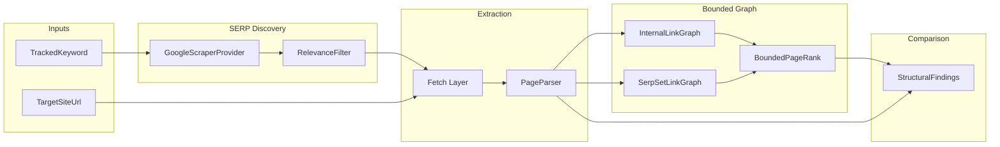

# SiteAnalyzer — SERP-Scoped Competitive Analysis Plan

> **ARCHIVED — historical design.** Operator workflow today: [OPERATOR-WORKFLOW.md](../OPERATOR-WORKFLOW.md). Competitor crawl additive module: [decisions/010-competitor-crawl-planned.md](../decisions/010-competitor-crawl-planned.md).
>
> Greenfield .NET 10 project. ADR index: [decisions/README.md](../decisions/README.md).

## Implementation checklist

- [x] **Phase 0** — Decisions 0A–0H + ADRs; filter fixture matrix passes; calibration matrix recorded
- [x] **Phase 1** — PostgreSQL schema + seeds + migration gate queries
- [x] **Phase 2** — Step-gated services pipeline (extraction, SERP, filter, graph, comparison, gates, SignalR)
- [x] **Phase 3** — REST API + `advance` endpoints
- [x] **Phase 4** — Next.js debug UI + SignalR subscription
- [x] **Phase 5** — Unit + integration tests tied to row-count gates

---

## Guardrails (non-negotiable)

- **Greenfield only**: net-new repo, schema, and services. The existing platform codebase is explicitly out of scope — do not read, migrate, share tables with, or mirror patterns from it. The two known bugs (H1-only extraction, unfiltered SERP URLs) are *problem statements* that motivate this build, not migration targets.
- **Project boundary**: every persisted artifact is scoped by `project_id` (and run-scoped child keys). No global/open-web index; no cross-project queries in v1.
- **SERP order is external**: ranking positions come from imported Google organic results (production: operator-saved HTML), never recomputed as an internet-wide ranker. Automated scrape paths exist for dev/legacy only — see [OPERATOR-WORKFLOW.md](../OPERATOR-WORKFLOW.md).
- **No third-party SERP API, ever**: SerpAPI, DataForSEO, Serper.dev, and equivalents are out of scope in all environments — including as fallback when the scraper fails.
- **Bounded graphs only**: internal link graph for the target site + inter-domain edges among URLs in the current analysis run. PageRank-style scoring runs on that node set only.
- **No stub data**: services write real rows from real HTTP/SERP calls; progress is proven by queryable counts.
- **Forward-only binary gates**: each phase has pass/fail criteria; failure blocks the next phase.
- **Step-gated v1 orchestration**: each pipeline stage halts after its gate; next stage runs only on explicit `POST /runs/{id}/stages/{stage}/advance`. SignalR (`RunProgressHub`) observes and reports — it does not drive orchestration.
- **Bounded AI exception (0H)**: one AI call per **target site** per run for business-focus classification + generated JSON-LD, cached on re-run by default. Never per keyword, article, or competitor URL. Documented in §0H and ADR [`009-business-focus-extraction.md`](decisions/009-business-focus-extraction.md).



---

## Phase 0 — Technical Decisions (no application code)

**Deliverable**: ADRs in [`docs/decisions/`](decisions/) (001–008). Calibration matrix and filter fixture details recorded there; execution rules below are authoritative.

### 0A — JS rendering decision (required before Phase 2)

Evaluate on a fixed calibration URL set (10–15 URLs: React/Next, Angular, Wix, Squarespace, static HTML). Record per-URL matrix in ADR [`001-fetch-strategy.md`](decisions/001-fetch-strategy.md).

**Decision rule (default unless calibration disproves it)**:

- Use **raw HTTP first** for fetch + parse (AngleSharp or HtmlAgilityPack).
- Escalate to **Playwright** only when calibration shows ≥2 of: missing H2–H6, missing JSON-LD that headless finds, or empty main content block.
- Persist `fetch_mode` per page (`Http` | `Headless`).

### 0G — Self-built SERP discovery (replaces former 0B)

SiteAnalyzer owns Google organic-results discovery. **No third-party SERP API** in any environment. `fixture` remains dev/test-only (isolated from live calls).

**Tradeoff (locked)**: self-built scraping carries block/CAPTCHA/layout-drift risk that paid APIs absorb. That risk is accepted for full ownership and no per-query API cost. When the scraper fails, the run **fails loudly** — no silent empty/partial/stale degradation.

**Usage pattern (governs design)**: one client project at a time; ~one keyword per article; ~a dozen lookups per project. Human-paced, low-frequency — not industrial proxy-scale volume.

#### `ISerpProvider` — unchanged contract

```csharp
public interface ISerpProvider {
    string ProviderKey { get; }
    Task<SerpResultSet> FetchOrganicResultsAsync(SerpQuery query, CancellationToken ct);
}
```

**Live implementation**: `GoogleScraperProvider`, `ProviderKey = "google-scraper"`. `SerpProviderResolver` exposes **`google-scraper`** (live) and **`fixture`** (dev/test) only — **`serpapi` / `dataforseo` keys removed entirely** (no unknown-key fallback to fixture in production).

#### Request strategy

- **Pacing floor**: `GOOGLE_SCRAPE_MIN_DELAY_MS` (env, default several seconds). Hard minimum enforced even when the pipeline is ready sooner — prevents burst clustering.
- **Jitter**: random delay in `min .. min+buffer` band, not a fixed interval.
- **Headers**: realistic browser User-Agent + header set, rotated from a small maintained pool.
- **IP (locked, no proxy)**: requests from Railway-hosted Api egress directly. Revisit only via new ADR if observed block rate contradicts usage assumptions — do not pre-build proxy infrastructure.
- **Transport**: raw HTTP GET first (same principle as 0A). Playwright only if calibration shows raw HTTP blocked/incomplete. Record outcome in ADR [`008-serp-scraper.md`](decisions/008-serp-scraper.md).

#### Parsing strategy

- **Organic definition**: standard organic listings only — exclude paid ads, shopping carousels, local pack/map, featured snippets unless a future ADR adds separate signal types.
- **PAA captured**: parse People Also Ask to `serp_paa_results` (`run_id`, `question_text`, `sequence`). Downstream use is an **open decision** — data must exist and be queryable, not discarded.
- **Zero-count visibility**: `validation_message` must state organic + PAA counts explicitly (e.g. `"14 organic results, 0 PAA questions found."`).
- **Resilient selectors**: defensive parsing with fallback selectors per field (layout variants, not bad-data fallbacks).
- **Sanity check before persist**: parsed organic count = 0 or no url/title pairs → **stage failure** (`"SERP fetch returned no parseable organic results — likely blocked or layout changed. Stage failed."`), never a silent zero-results pass.

#### Adaptive pacing — early warning

Rolling window of recent request timestamps (see ADR 008 thresholds). If cadence trends automated, annotate `validation_message` and lengthen next delay proactively — advisory layer, not a second hard gate. Hard floor + jitter remain non-negotiable.

#### Failure handling (binary)

| Condition | Action |
|-----------|--------|
| CAPTCHA | Fail immediately; message identifies CAPTCHA |
| HTTP block (403/429) or 200 non-SERP body | Fail with status/signature in message |
| Partial row parse | Drop row; existing ≥10 gate applies to valid rows |
| Scrape failure | Run fails; no in-run retry/degrade (same as 0F) |

#### Unchanged by 0G

- `serp_results` columns (position, url, title, snippet, domain)
- Filter stage (0C) — source-agnostic on `serp_results` rows
- Step-gated orchestration (0F) — SERP first stage, auto on start, gate ≥ 10 organic rows
- `fixture` provider for dev/CI

#### Future multi-engine (interface note — not v1)

Rotating across engines (Google, Bing, DuckDuckGo) is a future phase. `ISerpProvider.ProviderKey` already supports multiple implementations; rotation logic sits **above** adapters. When built, confirm `analysis_runs.serp_provider_key` (or equivalent) captures source engine per run.

#### Phase 0 gate additions (0G)

- [ ] ADR [`008-serp-scraper.md`](decisions/008-serp-scraper.md) committed (calibration, pacing defaults, no-proxy rationale)
- [ ] Organic-result definition locked; PAA persisted to `serp_paa_results`
- [ ] Sanity-check-as-failure implemented (zero/malformed parse = stage fail)
- [ ] `SerpProviderResolver`: `serpapi`/`dataforseo` removed, not merely unused
- [ ] Web UI default provider = `google-scraper` in non-dev/non-test environments


### 0C — Relevance filter (four buckets — stress-test before Phase 0 closes)

Deterministic rules (no ML v1). Precedence is strict top-to-bottom; first match wins.

**Bucket 1 — Auto-exclude** (`filter_status = Excluded`, unless `include_reference_domains = true` on run):

- Seeded `reference_exclude_domains` (Wikipedia, Britannica, dictionary sites, pure news wire)
- URL patterns: `/wiki/`, informational `.gov` pages (configurable)
- Any URL whose registrable domain is in `project_owned_domains` (client secondary properties — never a competitor)

**Bucket 2 — Known-platform include** (`filter_status = Included`, `include_reason = KnownPlatform`):

- Seeded `known_platform_domains`: Reddit, Quora, YouTube, Stack Exchange, major industry forums
- Included by platform identity alone — **no commercial schema required**
- First-class SERP-stacking signals; neither reference noise nor commercial-intent gated

**Bucket 3 — Commercial / competitive include** (other `include_reason` values: `CompetitorSeed`, `CommercialIntent`, `MultiPropertyCascade`):

- Domain on optional `competitor_seed_domains`
- Post-fetch: commercial schema (`Product`, `Service`, `LocalBusiness`, `Offer`, `FAQPage`) or pricing/comparison language in title/snippet
- **Multi-property cascade** (tightened): same registrable domain as an already-included URL may cascade-include **only if**:
  - Domain not in `project_owned_domains` or target site's domain
  - Subdomain not on noise list (`support.`, `help.`, `docs.`, `status.`, `community.`) → Bucket 4 instead
  - Triggering URL was included via `KnownPlatform`, `CompetitorSeed`, or `CommercialIntent` — not via prior cascade alone

**Bucket 4 — Pending review** (`filter_status = PendingReview`):

- Ambiguous cases; excluded from fetch/graph/compare until manually approved
- Manual approval sets `filter_status = Included` and `include_reason = ManualOverride` on the `serp_url_candidates` row, making the URL eligible for downstream fetch/graph/compare stages

**Stress-test gate**: fixture SERP JSON in `tests/fixtures/serp/` must cover all six scenarios (Wikipedia exclude, Reddit/Quora KnownPlatform, cascade, support subdomain PendingReview, owned domain exclude). Full matrix and worked examples in ADR [`003-relevance-filter.md`](decisions/003-relevance-filter.md). Lock default Phase 2 verification keyword in ADR 003 (high-volume commercial query; Wikipedia in top 20).

### 0D — Target-site crawl bounds (locked numbers)

| Parameter | Default | Override |
|-----------|---------|----------|
| `max_crawl_depth` | **4** hops from homepage | `projects.max_crawl_depth` |
| `max_crawl_pages` | **150** pages | `projects.max_crawl_pages` |
| Stage timeout | **10 minutes** (BFS fetch) | env `CRAWL_STAGE_TIMEOUT` |

BFS stops when **either** limit is hit. Included SERP URLs fetch **outside** the BFS page cap. Rationale in ADR [`004-crawl-bounds.md`](decisions/004-crawl-bounds.md).

### 0H — Target-site business-focus extraction

Extends **target-site extraction only** — SERP discovery, filtering, competitor crawl, graph, PageRank, and comparison are unchanged. No second crawl or new fetch infrastructure.

**Why**: downstream components (e.g. future Niche Analyzer, Content Writer) need “what does this business do/sell?” from SiteAnalyzer via a **public API only** — no shared database access.

**Scope note**: Step 4 produces classification + generated JSON-LD — a deliberate, bounded exception to collection-only posture (one cheap call per site per run, cached). Richer niche modeling stays out of scope.

#### Step 1 — Audit findings (completed; do not skip)

| Check | Finding |
|-------|---------|
| `page_content_blocks` | **`content` column already stores cleaned block text** (main/article/table/list/faq), max 4000 chars — not structure-only |
| `page_json_ld` | **`raw_json` + `parsed_type`** populated per original schema |
| `page_headings` | **Full `text`** for H1–H6 in document order |

Step 3 (`text_content` column) is **not required** — existing `content` satisfies intent. See ADR 009.

#### Step 2 — BFS priority tuning (queue order only)

Priority URLs dequeue before same-or-greater-depth non-priority URLs within existing 0D caps. Patterns maintained in seeded **`crawl_priority_url_patterns`** (config table, not hardcoded) — default list in ADR [`009-business-focus-extraction.md`](decisions/009-business-focus-extraction.md). Primary nav links from homepage treated as priority.

#### Step 3 — Extraction extension

**Not required for v1** (audit confirmed text in `page_content_blocks.content`). Extract gate may add non-null coverage check on target-site `content` rows when 0H is implemented.

#### Step 4 — Business-focus classification + JSON-LD (single AI call, unconditional)

- **When**: end of **Extract stage** (same advance click as extraction — **not** a new gated stage)
- **Always runs** for target site — not gated on JSON-LD presence; existing JSON-LD is input, not bypass
- **Input**: target-site headings, meta, JSON-LD, `page_content_blocks.content` (priority pages first per Step 2)
- **Output** → **`target_site_business_profiles`**: business type, services, service area, description, `generated_schema_json`, `has_existing_schema`, `existing_schema_matches`, `generated_at`, optional `reused_from_run_id`
- **Caching**: same `project_id` + normalized `target_site_url` reuses prior profile by default — **no fresh AI call** on re-run (v1: manual refresh via `BUSINESS_PROFILE_FORCE_REFRESH=true` only; no content-hash auto-invalidation)
- **No AI** for SERP/competitor pages
- **`StructuredDataMismatch`** finding noted as future comparison-taxonomy fit — not built in 0H

#### Cross-codebase contract

`GET /runs/{id}/business-profile` — stable public JSON contract (ADR 009). Content Writer consumes this endpoint only in separate future work; **no Content Writer code changes in 0H**.

#### Phase 0 gate additions (0H)

- [ ] Step 1 audit recorded (above + ADR 009)
- [ ] `crawl_priority_url_patterns` seeded; BFS priority dequeue implemented
- [ ] Step 4: unconditional single AI call; output in `target_site_business_profiles`
- [ ] Cache/reuse on same-site re-run (no default repeat AI call)
- [ ] Confirmed: no AI on competitor pages
- [ ] `GET /runs/{id}/business-profile` with explicit 404 + reason code when not available
- [ ] Integration/contract test for endpoint response shape
- [ ] Endpoint contract in ADR 009; no Content Writer changes

### 0E — Comparison finding taxonomy + check model

**Finding types** (7 total):

- `StructuredDataGap` — schema type in ≥N top URLs, absent on target
- `HeadingStructureGap` — H2–H6 depth/count vs SERP median
- `ContentBlockGap` — FAQ, comparison table, pricing table in competitors, not target
- `InternalOrphanPage` — crawlable page, zero inbound internal links
- `InternalDepthIssue` — depth from homepage > threshold
- `InternalAuthoritySkew` — bounded PageRank concentration vs SERP baseline
- `OutboundLinkSignal` — shared outbound domains among competitors, not target (**cross-domain edges only**)

**Outcome model**: `ComparisonService` writes one row per finding type to `comparison_checks` (`outcome`: `Finding` | `NoFinding`). `findings` holds only `Finding` rows. **Zero findings is a pass** — gate requires 7 completed checks, not ≥N problems.

**SerpSet PageRank edges** (ADR [`005-bounded-pagerank.md`](decisions/005-bounded-pagerank.md)):

- `TargetInternal`: all `internal_links`
- `SerpSet`: only `cross_run_links` where `is_internal_to_domain = false` (intra-domain competitor self-links stored for audit, excluded from PageRank)

### 0F — Real-time channel + step-gated orchestration (required before Phase 2)

Locks three constraints: frontend stack version policy, SignalR as the only real-time channel, and step-gated (human-click) orchestration for v1.

#### Frontend stack version lock

Phase 4 UI: **Next.js (App Router) + React**, version pinned at Phase 4 start in ADR [`006-frontend-stack.md`](decisions/006-frontend-stack.md). "Latest" is not acceptable once Phase 4 begins — pin exact version; revisit only via new ADR.

#### Real-time channel: SignalR only

- **No raw WebSockets.** All server-to-client push via **`RunProgressHub`**.
- Hub broadcasts stage transitions, gate pass/fail, and `validation_message` to clients subscribed to a `run_id` group. Hub **does not** drive orchestration.
- Phase 4 UI subscribes on run detail entry; no polling for primary state. `GET /runs/{id}` remains fallback for reload/reconnect.
- Hub method contract in ADR [`007-signalr-channel.md`](decisions/007-signalr-channel.md).

#### Step-gated orchestration (v1 execution model)

Replaces continuous server-side pipeline (steps 2–8 in one pass). v1 requires explicit human click-through between every stage — binary/no-fallback at **per-stage** granularity.

**Execution model**:

- Each stage (SERP, Filter, Fetch, Extract, Graph, PageRank, Comparison) runs to completion, writes `run_gates` (`passed`: true | false), then **halts** — no auto-invoke of next stage.
- On halt: `analysis_runs.status = AwaitingConfirmation`; broadcast pass/fail + `validation_message` via `RunProgressHub`.
- Next stage runs only on `POST /runs/{id}/stages/{stage}/advance` (UI button → API).
- Gate failure (`passed = false`): `status = Failed`, no advance action. Recourse: read `validation_message`, start **new run** (stage retry out of scope for v1).

**Validation message requirement**:

Every stage must produce human-readable `validation_message` on the `run_gates` row — same text surfaced in UI and SignalR broadcast. Examples:

- SERP: `"14 organic results, 3 PAA questions found; gate requires >= 10 organic."`
- Extraction failure: `"0 of 6 fetched pages returned JSON-LD; gate requires >= 1. Stage failed."`
- Comparison: `"7 of 7 checks evaluated. 3 findings (1 high, 2 medium severity), 4 no-finding."`

**`analysis_runs.status` enum**:

| Status | Meaning |
|--------|---------|
| `Running` | Stage actively executing |
| `AwaitingConfirmation` | Stage passed, halted, waiting for click-through |
| `Failed` | Stage gate failed; no advance available |
| `Completed` | Comparison stage passed and confirmed |

**Phase 1 schema (from 0F)**:

- `run_gates.validation_message TEXT NOT NULL`
- `analysis_runs.current_stage TEXT`

### Phase 0 gate (pass/fail)

- [ ] ADRs 001–009 committed (fetch, SERP scraper, filter, crawl, PageRank, frontend, SignalR, business-focus)
- [ ] Fetch calibration matrix filled (ADR 001)
- [ ] Google scraper contract + pacing documented (ADR 008); paid SERP APIs absent from resolver
- [ ] Filter fixture stress-test matrix passes (ADR 003 + `tests/fixtures/serp/`)
- [ ] Default Phase 2 verification keyword documented (ADR 003)
- [ ] Step-gated orchestration + Failed no-advance documented (this plan §0F)
- [ ] 0G gate items satisfied (PAA table, sanity-check failure, UI default `google-scraper`)
- [ ] 0H gate items satisfied (audit, BFS priority, business profile + API contract)
- [ ] No open questions blocking schema design

---

## Phase 1 — Database Schema (PostgreSQL)

**Deliverable**: EF Core migrations in `src/SiteAnalyzer2.Infrastructure/Migrations/` + seed scripts.

### Core tables (all include `project_id`; runs are immutable snapshots)

| Table | Purpose |
|-------|---------|
| `projects` | Scope boundary; `max_crawl_depth` default 4, `max_crawl_pages` default 150 |
| `analysis_runs` | Keyword run: `status` (Running \| AwaitingConfirmation \| Failed \| Completed), `current_stage`, `keyword`, `target_site_url`, `serp_provider_key` |
| `serp_results` | Raw organic SERP rows: `run_id`, `position`, `url`, `domain`, `title`, `snippet` |
| `serp_paa_results` | People Also Ask: `run_id`, `question_text`, `sequence` (PAA count surfaced in gate message even when zero) |
| `serp_url_candidates` | Filter disposition: `filter_status`, `exclude_reason`, `include_reason` (KnownPlatform \| CommercialIntent \| CompetitorSeed \| MultiPropertyCascade \| ManualOverride) |
| `reference_exclude_domains` | Seeded reference/aggregator blocklist |
| `known_platform_domains` | Seeded platforms (Reddit, Quora, YouTube, forums) |
| `project_owned_domains` | Client-owned domains excluded from competitor classification |
| `comparison_checks` | One row per finding type: `outcome` Finding \| NoFinding, `payload_json` |
| `pages` | Fetched URL: `run_id`, `url`, `canonical_url`, `fetch_mode`, `http_status` |
| `page_headings` | `page_id`, `level` 1–6, `text`, `sequence` |
| `page_meta_tags` | `page_id`, `name_or_property`, `content` |
| `page_json_ld` | `page_id`, `raw_json`, `parsed_type` |
| `page_content_blocks` | `block_type` + **`content`** (cleaned text, max 4000 chars per block — audit §0H Step 1) |
| `crawl_priority_url_patterns` | Seeded URL path patterns for target-site BFS priority dequeue (§0H Step 2) |
| `target_site_business_profiles` | Step 4 output: business focus + generated JSON-LD; `reused_from_run_id` when cached (§0H) |
| `internal_links` | Target site only: `from_page_id`, `to_page_id`, `href`, `anchor_text` |
| `cross_run_links` | Run URL edges: `from_page_id`, `to_page_id`, `is_internal_to_domain` (SerpSet PageRank uses cross-domain only) |
| `page_rank_scores` | `page_id`, `graph_scope` TargetInternal \| SerpSet, `score` |
| `findings` | Rows where `comparison_checks.outcome = Finding` |
| `run_gates` | `run_id`, `stage`, `passed`, `validation_message` NOT NULL, `row_counts_json`, `checked_at` |

**Phase 1 gate (SQL, not UI)**:

```sql
SELECT COUNT(*) FROM reference_exclude_domains;  -- >= 20
SELECT COUNT(*) FROM known_platform_domains;     -- >= 10
SELECT table_name FROM information_schema.tables
  WHERE table_schema = 'public' AND table_name IN (
    'analysis_runs','serp_results','serp_paa_results','serp_url_candidates','pages','page_headings',
    'internal_links','cross_run_links','page_rank_scores','findings',
    'comparison_checks','run_gates','crawl_priority_url_patterns','target_site_business_profiles'
  );  -- = 14 tables
```

Pass = all tables exist + seed rows present.

---

## Phase 2 — Application / Services (.NET 10)

**Solution layout**:

```
SiteAnalyzer2.sln
├── SiteAnalyzer2.Api              # HTTP + RunProgressHub (SignalR)
├── SiteAnalyzer2.Services         # step-gated orchestration, gates, comparison
├── SiteAnalyzer2.Repositories     # EF Core + Dapper
├── SiteAnalyzer2.Infrastructure   # DbContext, migrations, Playwright
├── SiteAnalyzer2.Domain           # entities, enums, payloads
└── SiteAnalyzer2.Serp             # ISerpProvider: GoogleScraperProvider + fixture
```

### Service pipeline (single run, step-gated)

`RunGateService` write = gate row + `RunProgressHub` broadcast payload (no separate notify step).

| Trigger | Service | Persists | On pass | On fail |
|---------|---------|----------|---------|---------|
| `POST .../runs` | `AnalysisRunOrchestrator.StartRunAsync` | `analysis_runs` (`Running`, `current_stage=Serp`) | → SerpDiscovery | — |
| (auto with start) | `SerpDiscoveryService` → **`GoogleScraperProvider`** | `serp_results`, `serp_paa_results`, `run_gates` | `AwaitingConfirmation` + broadcast → **halt** | `Failed` + broadcast → **halt** |
| `POST .../stages/Filter/advance` | `RelevanceFilterService` | `serp_url_candidates`, `run_gates` | halt | `Failed` |
| `POST .../stages/Fetch/advance` | `PageFetchService` | `pages`, `run_gates` | halt | `Failed` |
| `POST .../stages/Extract/advance` | `PageExtractionService` then **`BusinessFocusClassificationService`** (target site only, end of Extract) | headings, meta, JSON-LD, blocks, `target_site_business_profiles`, `run_gates` | halt | `Failed` |
| `POST .../stages/Graph/advance` | `LinkGraphBuilderService` | `internal_links`, `cross_run_links`, `run_gates` | halt | `Failed` |
| `POST .../stages/PageRank/advance` | `BoundedPageRankService` | `page_rank_scores`, `run_gates` | halt | `Failed` |
| `POST .../stages/Comparison/advance` | `ComparisonService` | `comparison_checks`, `findings`, `run_gates` | `Completed` | `Failed` |

**PageFetchService**: BFS from homepage per §0D bounds + all included SERP URLs (outside page cap).

**BusinessFocusClassificationService** (0H, Extract sub-step):

- Runs **after** all pages extracted; **target site only**
- **Unconditional** single AI call per run (cache miss) — reuses `target_site_business_profiles` from prior run for same project + target URL by default
- Persists classification + generated schema.org JSON-LD; never calls AI for competitor pages

**PageExtractionService** (fixes H1-only failure):

- Full heading tree `h1`–`h6`, document order in `sequence`
- Canonical, meta (incl. OG/Twitter), all JSON-LD blocks
- Content blocks: `article`/`main`, tables, lists, FAQ patterns
- Internal links: same-registrable-domain only → `internal_links`

**BoundedPageRankService**: `TargetInternal` = all internal links; `SerpSet` = cross-domain `cross_run_links` only.

**ComparisonService**: 7 `comparison_checks` rows (Finding + NoFinding); `findings` only for Finding.

Failed run: `current_stage` stays on failed stage; `advance` rejected for that `run_id`.

### Phase 2 gate (row-count verification)

| Stage | Pass condition |
|-------|----------------|
| SERP | `COUNT(serp_results WHERE run_id = @run) >= 10`; `validation_message` includes organic + PAA counts |
| Filter | `Included >= 3` AND conditional: IF any raw SERP domain matches `reference_exclude_domains` THEN ≥1 excluded with reference reason ELSE TRUE. Fixture unit tests assert all §0C scenarios |
| Fetch | `COUNT(pages) >= included_candidates + 1` |
| Extract | H2–H6 headings >= 5 AND JSON-LD >= 1; target-site `page_content_blocks.content` non-null on ≥1 block when 0H implemented |
| Graph | `COUNT(internal_links) >= 1`; `COUNT(cross_run_links) >= 0` OK |
| PageRank | scores for all target + included SERP pages |
| Comparison | `COUNT(comparison_checks) = 7`, all outcomes non-null; zero `findings` valid |
| Run complete | `status = Completed`, all `run_gates.passed = true`, each stage advanced via API |

---

## Phase 3 — API

| Endpoint | Action |
|----------|--------|
| `POST /projects` | Create project |
| `POST /projects/{id}/runs` | Start run — executes SERP stage only; halts at `AwaitingConfirmation` |
| `POST /runs/{id}/stages/{stage}/advance` | Run next stage after prior gate passed (`Filter`, `Fetch`, `Extract`, `Graph`, `PageRank`, `Comparison`) |
| `GET /runs/{id}` | `status`, `current_stage`, latest `validation_message`, gate summary |
| `GET /runs/{id}/serp` | Organic SERP + PAA + filter disposition |
| `GET /runs/{id}/pages/{pageId}/extraction` | Headings, meta, JSON-LD, blocks |
| `GET /runs/{id}/graph` | Internal + cross-run edges + PageRank |
| `GET /runs/{id}/findings` | Finding outcomes only |
| `GET /runs/{id}/comparison-checks` | Full 7-check matrix incl. NoFinding |
| `GET /runs/{id}/business-profile` | Target-site Step 4 output (§0H). **404** + `{ error, reason }` when Extract not complete or profile not generated — never 200 with empty/null masquerading as absence |

**Phase 3 gate**: Phase 2 row-count queries satisfied; run driven entirely via API + stage-by-stage `advance`; SignalR push verified on hub subscription; `GET /runs/{id}` works without SignalR; `GET /runs/{id}/business-profile` contract test passes.

---

## Phase 4 — Web UI

**Stack**: Next.js (App Router) + React — version pinned at Phase 4 start (ADR 006).

Debug-first UI — **not** definition of done. SignalR primary; `GET /runs/{id}` for reconnect only.

1. Create project + start run
2. Run detail: gate checklist, **Advance** (enabled when `AwaitingConfirmation`), live `validation_message`
3. SERP table with include/exclude badges + reasons
4. Page extraction inspector
5. Graph view (edges + PageRank table)
6. Findings + comparison-check matrix (Finding / NoFinding)

**Phase 4 gate**: Displays real data from a passing run; pass/fail validated by DB queries only.

---

## Phase 5 — Tests

| Layer | Focus |
|-------|-------|
| Unit | Extraction HTML fixtures; full §0C filter fixture matrix |
| Integration | Testcontainers PostgreSQL; fixture SERP JSON; step-gated advance flow |
| Gate | Automated Phase 2 row-count predicates |

No mocks on persistence — assert rows inserted. Live Google scrape tests optional, `[Explicit]`.

**Phase 5 gate**: `dotnet test` green; filter fixtures pass; 7 `comparison_checks` regardless of `findings` count.

---

## Explicitly out of scope

- Open-ended crawl beyond bounded BFS + SERP-listed URLs
- Global link index or cross-project PageRank
- Custom internet-wide ranking algorithm
- **Any paid third-party SERP API** (SerpAPI, DataForSEO, Serper.dev, etc.), including as fallback when the scraper fails
- Automatic CAPTCHA solving or bypass
- Silent retry-and-degrade on scrape failure — failure is terminal for that run, same as every other stage
- Existing platform codebase (read or patch)
- Auto-advance / continuous pipeline in v1 (v2 auto-run toggle possible later)
- Partial/degraded stage retries (failed stage → new run)
- Raw WebSockets outside SignalR transport
- **0H additions**: Niche Analyzer component; Content Writer consumption of business profile; second target-site crawl; AI on competitor pages; `StructuredDataMismatch` finding type; automatic content-hash cache invalidation

---

## Suggested implementation order

1. Domain entities + enums (incl. `RunStatus`, `ComparisonOutcome`, filter buckets)
2. Migrations + domain seeds
3. `PageExtractionService` + HTML fixtures
4. `GoogleScraperProvider` + fixture + filter service + fixture matrix
5. Step-gated orchestrator + `RunGateService` + `RunProgressHub`
6. Remaining stage services + gate SQL checks
7. API + `advance` endpoints
8. Next.js UI + SignalR + advance controls
9. Integration tests tied to row-count gates
