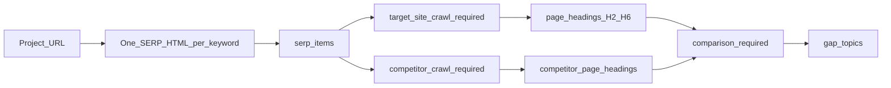

# Fix Site Analyzer research model

> **Superseded for active work.** Operator wiring described here is **shipped** (`OperatorRunFocusService`, comparison on `competitor_pages`, `gap_topics` assembly). Remaining Frase work — pack quality, UI, export docs — lives in **[frase-phase.md](frase-phase.md)**.

Canonical operator doc: [RESEARCH-MODEL.md](../RESEARCH-MODEL.md). ADR: [012-operator-research-model.md](../decisions/012-operator-research-model.md).

## Problem summary (historical)

Operator workflow on [site-analyzer.geekatyourspot.com](https://site-analyzer.geekatyourspot.com/) — **Project URL** = client site (e.g. `https://www.geekatyourspot.com/`):

**Was broken:** SERP + competitor data persisted, but `gap_topics` stayed NULL; target crawl and comparison were not wired on the operator path.

**Now (evidence):** `OperatorRunFocusService` orchestrates Step A (after SERP) and Step B (after crawl + comparison); `GetResearchFocusAsync` exposes gates. Verify on a production run before trusting docs.

| Field | Was | Now |
|-------|-----|-----|
| `gap_topics` | NULL | Populated when gates pass |
| Target crawl | Unwired | Wired after SERP |
| Comparison | Legacy `pages` only | `RunOperatorComparisonAsync` on `competitor_pages` |
| `niche_tags` | Keyword injection | Fixed |

## Design principles

- **Project URL** = site under analysis.
- **Keyword** (SERP `<title>`) = **content pillar** for that run.
- **SERP import**, **target crawl**, **competitor crawl**, and **comparison** are all **required** for research-ready.
- **Keep** `writing_recommendations` on site profile (visual only).
- Site Analyzer owns **`sa2`** facts; Content Writer reads `sa2` by `analysisRunId` ([HANDOFF.md](../HANDOFF.md), [INTEGRATIONS.md](../INTEGRATIONS.md)).

---

## Gap topics — definition

**Gap topics** = what this keyword article should cover, grounded in **comparison**, not a dump of `site_profiles` fields.

### Required inputs

1. **Pillar anchor** — `analysis_runs.keyword`
2. **Your structure** — H2–H6 from target-site crawl (`page_headings`, `is_target_site`)
3. **Competitor structure** — H2–H6 from `competitor_page_headings`
4. **Comparison** — [`ComparisonService`](../../src/SiteAnalyzer2.Services/Pipeline/ComparisonService.cs) → `findings` (**required**)

### How `gap_topics` is built

1. Run **comparison** → short strings from findings (FAQ missing, heading depth, schema gaps).
2. Add competitor H2–H6 themes not represented on your target headings (deduped).
3. Add your relevant H2–H6 for this pillar.
4. Optionally add SERP PAA / related searches not covered above.
5. At most **one** business framing line (Extract/homepage), not separate profile field bullets.

Implementation: `BuildGapTopicsFromResearch(...)`. Cap ~24–32, dedupe case-insensitive.

---

## Handoff (Geek-SEO)

| Step | Meaning |
|------|---------|
| **URL** | `/content-writing?analysisRunId=<uuid>` only — see [HANDOFF.md](../HANDOFF.md) |
| **Create** | Document stores run id + project from `analysis_runs` |
| **Use** | Writer queries `sa2` by `RunId` when drafting / scoring / Insights |

Gate resolution: [INTEGRATIONS.md](../INTEGRATIONS.md#research-ready-gates).

---

## Run focus assembly (`OperatorRunFocusService`)

Orchestration that fills `analysis_runs` fields after workflow steps.

### Step A — After SERP import

- `matched_pillar_topic` = keyword
- `matched_pillar_intent` / `matched_pillar_angle` from SERP helpers
- Start **target-site crawl** for Project URL
- **Do not** set final `gap_topics`

### Step B — After competitor crawl + target crawl + comparison

- Run **Comparison** (required)
- Build **`gap_topics`**
- Set **`writing_instructions`** (factual only)
- Update `site_profiles.authority_page_urls` from organic SERP when wired

Hooks: [`KeywordWorkflowService`](../../src/SiteAnalyzer2.Services/Integrations/KeywordWorkflowService.cs), [`CompetitorCrawlJobService`](../../src/SiteAnalyzer2.Services/CompetitorCrawl/CompetitorCrawlJobService.cs).

---

## Implementation todos

| ID | Task | Status |
|----|------|--------|
| `target-site-crawl` | Wire target-site crawl + Extract for Project URL on each keyword run | **Done** |
| `comparison-required` | Extend ComparisonService for `competitor_pages` + target pages | **Done** |
| `operator-run-focus` | OperatorRunFocusService; Step A after SERP, Step B after crawl + comparison | **Done** |
| `gap-topics-formula` | Build `gap_topics` from comparison + headings + pillar | **Done** |
| `fix-niche-tags` | Remove keyword injection; pillars API/UI from `analysis_runs.keyword` | **Done** |
| `serp-filter-labels` | Run RelevanceFilterService after SERP import; label rows, do not drop | **Done** |
| `sync-schema` | Copy `target_site_business_profiles.GeneratedSchemaJson` to `site_profiles` | pending |
| `authority-urls` | Update `authority_page_urls` from organic `serp_items` | partial / verify |
| `ui-labels` | Relabel fields; show pillars, gaps, workflow gates | partial → [frase-phase.md](frase-phase.md) Task 3 |
| `tests` | Tests for comparison-backed gaps, target crawl, SERP filter, export | **Done** (core unit tests) |

---

## Out of scope

- Geek-SEO code changes (optional gate tightening — separate repo)
- SA2 article outlines (Writer-owned)
- Removing `writing_recommendations` content
