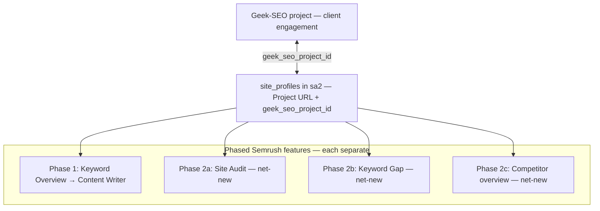
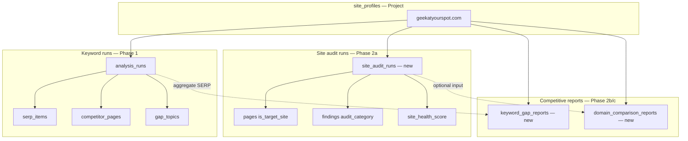
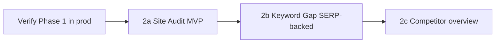

# Plan: Site Audit & competitive research (Phase 2+)

**Status:** Planning — do not implement until Phase 1 (pillar research) is verified in production.

**Context:** Phase 1 wires keyword-run research for Content Writer (Semrush **SEO Writing Assistant** analog). Phase 2+ adds **additional Semrush features** into the same **Geek-SEO project** — each as its own slice. Facts stay in `sa2`; operator UI primarily in Site Analyzer Web today.

**Not conflated:** Create Site Profile is bootstrap (`site_profiles` + project link). **Site Audit**, **Keyword Gap**, and **Competitor overview** are separate phased features — none of them are “what we already built” in Phase 1.

See also: [RESEARCH-MODEL.md](../RESEARCH-MODEL.md), [ADR 012](../decisions/012-operator-research-model.md), [INTEGRATIONS.md](../INTEGRATIONS.md), `.cursor/rules/00-project-context.mdc`.

---

## Geek-SEO project = Semrush Project



| Layer | Role |
|-------|------|
| **Geek-SEO project** | Operator-facing project shell; Content Writer documents |
| **`site_profiles`** | `sa2` anchor for one Project URL; links to Geek-SEO project |
| **Phased features** | Independent jobs, APIs, pass/fail gates — share crawl/extract engines only |

---

## Semrush → phased features (within one Geek-SEO project)

| Semrush capability | Site Analyzer (planned) | Unit of work | Feeds Content Writer? |
|--------------------|-------------------------|-------------|------------------------|
| Site Audit | **Site audit run** | Per **Project URL** | Indirect (site health context) |
| Keyword Gap | **Keyword gap report** | Per project + competitor set | Yes (new pillars to target) |
| Domain Overview | **Competitor overview report** | Per project — **you + up to 5 competitors** in **one** report | Yes (positioning, benchmarks) |
| SEO Writing Assistant | Content Writer | Per keyword document | Consumer |
| Keyword Overview | **Keyword overview run** (`analysis_runs`) | Per **keyword** + SERP (+ crawl) | Yes (primary today) |

### Critical naming (avoid drift)

| Term in Semrush | Our term today | Meaning |
|-----------------|----------------|---------|
| Keyword Gap | **Not** `gap_topics` | Keywords competitors rank for that you don’t (portfolio gap) |
| Content gap | `analysis_runs.gap_topics` | Topics one **article** should cover for **one pillar** |
| Site Audit issue | `findings` (category-tagged) | Technical/on-page problem on **your** site |
| Domain Overview | **Competitor overview** | One report: **your domain + up to 5 competitors** side-by-side |
| Semrush Project | **Geek-SEO project** | Client engagement; links to `site_profiles` |
| Create Site Profile | **Bootstrap** (not a Semrush feature) | Register Project URL in `sa2`; does not run audit or keyword gap |

---

## What Phase 1 already gives us (engine reuse only)

Phase 1 built **pillar research**, not Site Audit. Phase 2 features are **net-new** product work; they may **reuse crawl/extract infrastructure** from Phase 1:

| Asset | Reuse for Phase 2 |
|-------|-------------------|
| `PageFetchService` / target BFS | Full **site audit crawl** (same engine, site-scoped run) |
| `PageExtractionService` | Headings, meta, JSON-LD, content blocks |
| `findings` + `ComparisonCheck` | Extend with **audit categories** + severity |
| `competitor_pages` + SERP seeds | Per-pillar competitor data |
| `serp_items` across runs | Aggregate for **keyword gap** per project |
| `site_profiles` | Audit project root |
| `OperatorRunFocusService` pattern | `SiteAuditOrchestrator` (new, parallel — don’t overload keyword path) |
| SSE + job status on `analysis_runs` | Same pattern for `site_audit_runs` |

**Do not** extend legacy `/runs/*` `AnalysisRunOrchestrator` for operator audit.

---

## Run types (data model direction)

Introduce explicit **run kind** so keyword research and site audit don’t share one lifecycle.



**Minimal schema sketch (when implementing):**

- `site_audit_runs`: `id`, `site_profile_id`, `status`, `crawl_started_at`, `crawl_finished_at`, `pages_crawled`, `health_score`, `errors_count`, `warnings_count`, category rollups JSON
- Link `findings` to `site_audit_run_id` (nullable; keyword runs keep `run_id` on `analysis_runs`)
- `keyword_gap_reports`: snapshot of keyword opportunities (your domain vs competitor domains)
- `domain_comparison_reports`: side-by-side metrics snapshot

Defer full schema until **Slice 2a-1**; design first, migrate second.

---

## Phased delivery (slices only)

Each slice has **one pass/fail check**. No slice starts until the prior slice is verified in production or tests.

### Phase 2a — Site Audit (Semrush Site Audit row)

**Goal:** Project dashboard row like Semrush — pages crawled, site health, errors/warnings by category.

| Slice | Deliverable | Pass/fail |
|-------|-------------|-----------|
| **2a-1** | ADR 013 + `site_audit_runs` entity + `POST /sites/{id}/audit` starts crawl | Row in `site_audit_runs`, status `running` → `complete` |
| **2a-2** | Full-site target crawl bound to audit run (not keyword run) | `pages` count ≥ 1, `is_target_site`, linked to audit run |
| **2a-3** | `SiteAuditCheckService` — first categories: **Crawlability**, **HTTPS**, **Markups** (JSON-LD/meta) | `findings` with `audit_category`; errors vs warnings |
| **2a-4** | Health score rollup + `GET /sites/{id}/audit/latest` | JSON: `healthScore`, `errors`, `warnings`, category % |
| **2a-5** | Web UI: project **Site Audit** panel (not keyword page) | Shows last crawl date, /100, category list |

**Later categories (2a+):** Internal linking, Site performance (needs CWV API), AI Search Health (schema/FAQ heuristics).

**Out of scope 2a:** Scheduled recrawl cron, email alerts, PDF export.

---

### Phase 2b — Keyword Gap (Semrush Keyword Gap)

**Goal:** “Keywords competitors rank for that we don’t” — **portfolio** gap, not article `gap_topics`.

| Slice | Deliverable | Pass/fail |
|-------|-------------|-----------|
| **2b-1** | Define inputs: aggregate `serp_items` + organic URLs across all `analysis_runs` for project; competitor domains from `competitor_domains` or SERP | Doc + ADR: data sources only |
| **2b-2** | `KeywordGapService` — for each competitor domain, keywords where they appear in organic SERP and you don’t (same registrable domain) | `keyword_gap_reports` rows or JSON snapshot |
| **2b-3** | `GET /sites/{id}/keyword-gap` | Returns ranked opportunity list with source run/keyword |
| **2b-4** | UI: “Keyword Gap” step after ≥2 pillar runs | Table: keyword, competitor domain, your coverage yes/no |

**Data limitation (honest):** Without rank-tracking API or broad SERP coverage, keyword gap is **bounded to keywords you’ve imported** + their SERP organic rows — not full Semrush keyword universe. Plan v1 = **SERP-import-backed gap**, not millions of keywords.

**Optional v2:** Manual keyword list upload or DataForSEO/SerpAPI expansion (ADR separate).

---

### Phase 2c — Domain Overview (Semrush **Domain Overview**)

**Goal:** One **Domain Overview** report for a **single domain** — authority/traffic/keyword snapshot (Semrush Domain Overview analog). **Not** Compare Domains (you + up to 5 competitors side-by-side; that is a separate phase).

**Constraints (v1):**

- **Input** = one domain or project URL (normalized `https://www.{host}/`).
- **No keyword run** required — standalone on operator page.
- **Honest gaps:** traffic, authority, backlink counts show `—` until external index API (DataForSEO / Semrush / etc.).

| Slice | Deliverable | Pass/fail |
|-------|-------------|-----------|
| **2c-1** | `DomainOverviewService` + DTO; homepage fetch + sa2 project stats | `GET/POST /domain-overview` |
| **2c-2** | Metrics v1: site audit health, pillar keyword count, homepage H2/schema | UI metric strip |
| **2c-3** | UI: **Domain Overview** panel — one domain field, Load / Analyze | Report renders |
| **2c-4** | (Later) External index for authority, organic traffic, keyword count | ADR when provider chosen |

**UI label:** “Domain Overview”. Semrush name: Domain Overview.

---

### Phase 2d — Compare Domains (Semrush **Compare Domains**)

**Goal:** Side-by-side comparison of **your** Project URL against **up to five** competitor domains. Distinct from Domain Overview (single domain).

| Slice | Deliverable |
|-------|-------------|
| **2d-1** | ADR + `CompareDomainsService` — multi-column report |
| **2d-2** | `GET /sites/{id}/compare-domains?domains=` (max 5) |
| **2d-3** | UI: pick ≤5 competitors, one table/chart block |

**UI label:** “Compare Domains”. Not “Domain Overview”.

---

## Operator workflow (future — two modes)

Today: **Keyword mode** only (`page.tsx`).

Future Web IA (single app, two tabs):

```
Project URL
├── Project setup
│   ├── Create Site Profile
│   └── Run Site Audit
├── Keyword Overview          ← Phase 1 (SERP + crawl + gaps; no site data in report)
├── Keyword Gap         ← Phase 2b
└── Competitor overview ← Phase 2c (Semrush Domain Overview; ≤5 competitors, one report)
```

Content Writer handoff stays on **Keyword Overview** tab only until CW needs audit data.

---

## Finding categories (Site Audit checklist)

Map toward Semrush-style columns. Extend `FindingType` or add `audit_category` on `findings`.

| Category | Example checks | Existing code |
|----------|----------------|---------------|
| Crawlability | orphan pages, depth > N, 4xx/5xx | `InternalOrphanPage`, `InternalDepthIssue` (legacy comparison) |
| HTTPS | mixed content, http:// URLs | **New** |
| International SEO | hreflang missing | **New** |
| Site performance | CWV, page weight | **New** (external API) |
| Internal linking | orphan, authority skew | `InternalAuthoritySkew`, PageRank (legacy) |
| Markups | JSON-LD missing, FAQ schema | `StructuredDataGap` (operator comparison) |
| Core Web Vitals | LCP, CLS, INP | **New** |
| AI Search Health | FAQ blocks, speakable, entity schema | **New** (heuristic) |

Start with **Crawlability + HTTPS + Markups** — achievable from crawl + extract only.

---

## Health score (v1 formula)

Keep simple and explainable (not Semrush’s black box):

```
health_score = 100 - (errors * W_error) - (warnings * W_warn)
```

Cap categories 0–100% as: `100 * (1 - issues_in_category / pages_crawled)` for display columns.

Store rollup on `site_audit_runs`; recompute on each audit complete.

---

## API surface (planned)

| Endpoint | Phase |
|----------|-------|
| `POST /sites/{siteProfileId}/audit` | 2a-1 |
| `GET /sites/{siteProfileId}/audit/latest` | 2a-4 |
| `GET /sites/{siteProfileId}/audit/{auditRunId}` | 2a-4 |
| `GET /sites/{siteProfileId}/keyword-gap` | 2b-3 |
| `GET /sites/{siteProfileId}/competitor-overview` | 2c-3 (query: up to 5 competitor domains) |

Existing keyword routes unchanged.

---

## Implementation order (recommended)



**Why this order:**

1. **Site Audit** reuses crawl/findings; standalone value (your Semrush screenshot).
2. **Keyword Gap** needs multiple pillar SERPs — builds on Phase 1 usage.
3. **Competitor overview** (Semrush Domain Overview) benefits from audit crawl + competitor aggregates; one report, you + ≤5 competitors.

---

## Out of scope (all Phase 2)

- Full Semrush keyword database / rank tracking
- Backlink index
- Position tracking over time (unless separate ADR)
- Geek-SEO repo changes (export fields only when needed)
- Replacing `gap_topics` with keyword gap results
- Legacy `/runs/*` pipeline extensions

---

## Next action (when you’re ready)

1. **Verify Phase 1** on production: one pillar end-to-end, `gap_topics` populated.
2. **ADR 013** accepted — `site_audit_runs` vs overloading `analysis_runs`. UI: [site-audit-ui-design.md](site-audit-ui-design.md).
3. **Implement Slice 2a-1 only** — migration + `POST /sites/{id}/audit` + pass/fail test. Check/rollup services scaffolded in `SiteAuditCheckService` / `SiteAuditRollupService`.

---

## References

- Semrush Site Audit categories (product reference): Crawlability, HTTPS, International SEO, Core Web Vitals, Markups, etc.
- [004-crawl-bounds.md](../decisions/004-crawl-bounds.md) — crawl limits
- [010-competitor-crawl-planned.md](../decisions/010-competitor-crawl-planned.md) — competitor tables
- [ComparisonService.cs](../../src/SiteAnalyzer2.Services/Pipeline/ComparisonService.cs) — extend, don’t fork keyword logic
