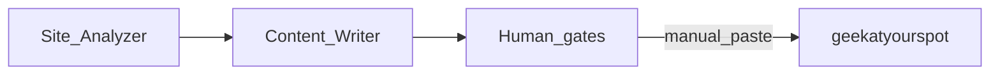

# Content Writer — Marketing export bundle

**Status:** Planned  
**Phase:** [`IMPLEMENTATION-PLAN.md`](IMPLEMENTATION-PLAN.md) § 1.5  
**Publish target:** **geekatyourspot** repo (manual paste)  
**Related:** [`content-writing-prompt.md`](content-writing-prompt.md), [`SERP-RESEARCH-AGENT-PROMPT.md`](SERP-RESEARCH-AGENT-PROMPT.md)

## Two-repo model

| Repo | Role |
|------|------|
| **Geek-SEO** | Site Analyzer researches → **Content Writer produces** drafts |
| **geekatyourspot** | Human **pastes** into TS catalogs/posts; build gates enforce publish rules |

No CMS sync at current volume.



**SRP:** Site Analyzer researches; Content Writer writes.

---

## Governing principle

**Binary outcomes, no silent degradation.** Export fields required at contract level. No `??` fallback between `homeSummary` and `hubSummary`. Export validation runs in Geek-SEO **before** copy is offered.

---

## Five assets per topic (pillar-first order)

| Order | Asset | Content Writer | Human gate |
|-------|-------|----------------|------------|
| 1 | **Pillar** — HTML + 5 FAQs + sources (1,500–2,500 words) | ✅ draft | SEO/brand edit |
| 2 | **homeSummary** — outcome/example; homepage | ✅ draft | ✅ approve |
| 3 | **hubSummary** — definitional; department hub card | ✅ draft | ✅ approve |
| 4 | **metaDescription** — 150–160 chars; distinct wording | ✅ draft | distinct-string gate only |
| 5 | **Blog spoke** — 800–1,200 words; different intent | ✅ draft | SEO/brand edit |

Summaries are **derived from pillar thesis** (manual derivation; no auto-gen from HTML in v1).

### Style contrast (example: Content Operations)

- **homeSummary:** "AI content ops tools generate thousands of localized variations in seconds and cut audit time from hours to minutes, so small teams publish at enterprise scale."
- **hubSummary:** "AI content operations integrates automation across the full content lifecycle, from planning and production to distribution and analytics, without sacrificing quality."

All three strings (`homeSummary`, `hubSummary`, `metaDescription`) must be **pairwise distinct**.

---

## Spoke SEO rule — different intent, not modifier

Blog spoke **must not** target the pillar `primaryKeyword` or a longer-tail modifier of it (cannibalization).

| Invalid spoke | Why |
|---------------|-----|
| Pillar: `AI content operations` → Spoke: `AI content operations implementation` | Same intent + modifier |

| Valid spoke types | Examples |
|-------------------|----------|
| Cost | what AI content tooling actually costs |
| Comparison | AI content ops vs manual workflow |
| Local angle | AI content help for South Florida SMBs |
| How-to / myth-bust / case-style | only if primary keyword is genuinely distinct |

---

## Geek-SEO implementation

### Export contract (API / UI)

Per assignment, emit:

```json
{
  "departmentSlug": "marketing",
  "useCaseSlug": "content-operations",
  "primaryKeyword": "AI content operations",
  "pillarHtml": "...",
  "faqs": [],
  "homeSummary": "...",
  "hubSummary": "...",
  "metaDescription": "...",
  "blogSpoke": {
    "slug": "ai-content-ops-vs-manual-workflow",
    "primaryKeyword": "AI content operations vs manual",
    "spokeType": "comparison",
    "html": "..."
  }
}
```

### Export validation (Geek-SEO — before copy)

1. **Required-distinct** — `homeSummary`, `hubSummary`, `metaDescription` all non-empty and pairwise distinct.
2. **Keyword registry** — pillar vs spoke `primaryKeyword`: fail on exact collision or normalized-substring collision (lowercase + stopword strip).

Implement in application layer + unit tests (mirror geekatyourspot `lib/seo/keyword-registry.ts` rules).

### UI workflow

1. Content Writer emits pillar draft → human edits pillar  
2. Tool derives summaries + meta → human approves summaries  
3. Tool emits spoke draft (declared spoke type + keyword) → human edits spoke  
4. Export panel shows copy targets + validated bundle  

### Handoff doc

Add [`docs/content-writer-handoff.md`](../docs/content-writer-handoff.md) with paste map:

| Export field | geekatyourspot file |
|--------------|---------------------|
| Catalog fields | `data/use-cases/{dept}/catalog.ts` |
| Pillar HTML | `data/use-cases/{dept}/pages/{slug}.ts` or equivalent |
| Blog spoke | `data/blog/posts/{slug}.ts` + `data/blog/catalog.ts` |

---

## geekatyourspot scope (not this repo)

Tracked in geekatyourspot repo:

- `UseCasePage` types — required `homeSummary`, `hubSummary`, `metaDescription`, `primaryKeyword`
- Four department catalogs
- Blog infra + `lib/blog/related.ts` reverse index (blog declares pillar; pillar derives spokes)
- Build gates: `lib/content/validate.ts`, `lib/seo/keyword-registry.ts`
- `docs/content-writer-brief.md` — paste targets + spoke-intent menu

**Pilot topics:** `content-operations`, `market-intelligence-and-analytics` (marketing). Prefer **3 blog spokes at launch** so `/blog` index is not thin.

---

## Out of scope (v1)

- CMS / Airtable integration
- Auto-generating summaries from pillar HTML
- Duplicating pillar body as blog post

---

## Success criteria

- Content Writer emits all five assets in pillar-first order
- Export blocked on duplicate summaries or keyword collision
- Operator can copy one validated bundle into geekatyourspot
- geekatyourspot build gates catch any paste mistakes
