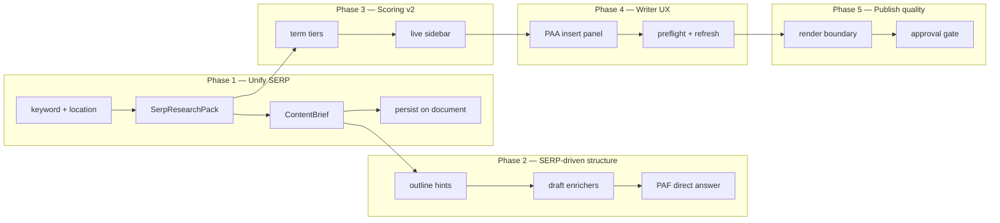

# Content Writing Improvement Plan

**Status:** Proposed (June 2026)  
**Owner:** Content Writing product surface — `/app/content-writing`  
**Out of scope:** Niche Analyzer reliability, site-wide pillar discovery, topical map

**Related:** [`content-writing-prompt.md`](./content-writing-prompt.md), [`SERP-RESEARCH-AGENT-PROMPT.md`](./SERP-RESEARCH-AGENT-PROMPT.md), [`CONTENT-WRITER-FEATURES.md`](./CONTENT-WRITER-FEATURES.md)

---

## North star

> **One keyword → one SERP Research Pack → one brief → outline → draft → score → render — all grounded in what Google is already rewarding for that query.**

Content Writing wins when every article is shaped by **PAA**, **PASF**, and **PAF** (Primary Answer Feature), plus competitor outlines — not by a site-wide niche profile that takes weeks and still misidentifies the business.

---

## Honest current state

| Piece | Status | Gap |
|-------|--------|-----|
| `/app/content-writing` | Shipped — brief → outline → draft → review | Uses `generateBrief`, not the richer research pack |
| `SerpResearchPackService` + `/app/strategy/url-analyzer` | Shipped — PAA, PASF, PAF, outlines, intent | **Disconnected** from content-writing workflow |
| `ContentBriefService` | Shipped | Still calls `INicheProfileRepository` + gap topics for FAQ backfill |
| `ArticlePromptBuilder` + enrichers | Shipped | Methodology H2s are rubric-driven; pack `methodologyHints` unused |
| `ArticleClosingFaqEnricher` | Shipped | Enforces 5 FAQs post-draft; PAA-first when present |
| `ArticleMethodologyOutlineEnricher` | Shipped | Repairs outline; uses competitor headings only lightly |
| `ArticleRenderService` | Shipped | Re-fetches brief on every render; schema appended to HTML |
| `ContentScoringService` v1 | Shipped | Keyword word-split + AI terms; **not** SERP co-occurrence tiers |
| Approval / publish gates | Partial | `awaiting_review` status exists; no hard publish block |

**Core problem:** two SERP pipelines (`ContentBriefService` vs `SerpResearchPackService`) and a niche dependency that barely affects the article body.

---

## Design principles

1. **SERP is the source of truth** for a given keyword + location. Project record supplies business name, URL, geo anchors, author org — nothing else.
2. **Persist the research pack** on the content document so brief, outline, draft, score, and render all read the same snapshot (no silent re-fetch drift).
3. **PAA / PASF / PAF drive structure**, not just the FAQ footer:
   - PAA → closing FAQ (5) + overflow H3s in body
   - PASF → `recommendedTerms` + semantic coverage score
   - PAF → direct-answer block format and length target
4. **Four Phase Methodology is a spine, not a table of contents** — movement labels stay internal; visible H2s come from SERP gaps and competitor outlines.
5. **Enforce after generate** — prompts ask; enrichers verify (FAQ, movements, direct answer). Models skip instructions; code must not.
6. **Niche Analyzer is optional downstream** — never block writing on a completed niche run.

---

## Phased roadmap



### Phase 1 — Unify SERP input (highest ROI)

**Goal:** One research path feeds the brief. Remove niche as a brief dependency.

| Task | Detail |
|------|--------|
| Brief builds from pack | `ContentBriefService.GenerateBriefAsync` delegates to `SerpResearchPackService.BuildAsync`, then maps pack → `ContentBrief` |
| Map pack fields | `paa` → `PeopleAlsoAsk` + `ClosingFaqQuestions`; `pasf` → `SerpIntelligence.RelatedSearches`; `paf` → `SerpIntelligence.FeaturedSnippet` + `DirectAnswerBlocks`; `competitorOutlines` → heading highlights; `benchmarks.medianWordCountTop5` → `TargetWordCount`; `recommendedTerms` → `RecommendedTerms`; `methodologyHints` → `SuggestedHeadings` |
| Persist pack on document | Add `SerpResearchPackJson` (or `research_pack_id`) on `SeoContentDocument`; set at brief time; render/score read stored pack, not live re-fetch |
| Fold URL Analyzer into Content Writing | Move research UI into brief step on `/app/content-writing`; keep `/app/strategy/url-analyzer` as redirect or dev-only |
| Remove niche from brief | Drop `INicheProfileRepository` / `GetTopicalGapsAsync` from `ContentBriefService`; remove `NicheContext` from prompts and brief UI |
| Optional paste import | Accept pasted JSON matching `SerpResearchPack` when live SERP fails (uses [`SERP-RESEARCH-AGENT-PROMPT.md`](./SERP-RESEARCH-AGENT-PROMPT.md)) |

**Acceptance:**
- Generate brief with **no niche profile** on project → full brief with PAA, PASF, PAF, terms, word count, competitor headings
- Same keyword produces identical brief when pack is loaded from document JSON (no second SERP call)
- `ContentWritingPromptingTests` updated: no niche mocks required for happy path

**Touchpoints:** `ContentBriefService.cs`, `SerpResearchPackService.cs`, `BriefModels.cs`, `BriefsController.cs`, `content-writing/page.tsx`, `seo-api.ts`, persistence entity + HTTP repo for document field

---

### Phase 2 — SERP-driven structure (outline + draft)

**Goal:** Article shape matches SERP intent and competitor outlines, not generic phase labels.

| Task | Detail |
|------|--------|
| Outline from `methodologyHints` | `ArticlePromptBuilder` + `ArticleMethodologyOutlineEnricher` use pack hints for topic-specific H2s per movement |
| PAA overflow | Questions beyond the closing 5 become H3 candidates under the best-matching movement |
| PASF in body | Top related searches appear in `RecommendedTerms` and as optional H3 suggestions in outline repair prompt |
| PAF enricher | New or extend `ArticleDirectAnswerEnricher`: if opening paragraphs lack 40–60 word answer matching PAF format (paragraph/list/table), inject or repair |
| Intent-aware word count | `informational` → longer benchmark; `local` → emphasize geo anchors in movements 1 and 4 |
| Pre-flight warnings | Before outline: warn if `paa.length < 3`, `competitorOutlines.length < 3`, or `dataQuality !== live` |

**Acceptance:**
- Outline H2s are keyword-specific (not "Business Objectives" as visible headers)
- Draft opens with direct-answer block when PAF present
- Tests: outline contains movement labels + SERP-derived H2s; draft has FAQ + direct answer when pack includes PAF

**Touchpoints:** `ArticlePromptBuilder.cs`, `ArticleMethodologyPrompt.cs`, `ArticleMethodologyOutlineEnricher.cs`, `ArticleMethodologyDraftEnricher.cs`, new `ArticleDirectAnswerEnricher.cs`

---

### Phase 3 — Scoring v2 (SERP-grounded terms)

**Goal:** Live score reflects the same term set the brief promised — like Surfer/NeuronWriter missing-terms workflow.

| Task | Detail |
|------|--------|
| Term tiers from pack | Required = terms in 40%+ of competitor headings/snippets; Important = 20%+; Supplemental = PASF + AI extraction |
| Sidebar term table | All / Used / Missing filter; click term → scroll highlight in editor (stretch) |
| Letter grade | A++ … F mapped from 0–100 (see CONTENT-WRITER-FEATURES) |
| Readability | Flesch-Kincaid as secondary dimension |
| Score uses stored pack | `ContentScoringService` reads document's `SerpResearchPackJson` for terms and benchmark word count |
| GEO depth check | Score bonus when body H3s cover PAA questions beyond the FAQ section |

**Acceptance:**
- Changing draft text updates term counts in sidebar within debounce window
- Missing required terms surface actionable suggestions
- Score does not call niche APIs

**Touchpoints:** `ContentScoringService.cs`, `score-sidebar.tsx`, `useContentScoring.ts`, new `TopicTermMatrixBuilder.cs` (or extend `SerpResearchPackService`)

---

### Phase 4 — Writer UX (one workspace)

**Goal:** `/app/content-writing` is the only surface users need.

| Task | Detail |
|------|--------|
| Brief panel | Show PAA, PASF, PAF, intent badge, data quality, top competitors inline |
| Research refresh | "Refresh SERP" clears pack + brief; keyword/location change prompts refresh |
| PAA sidebar tab | Click question → insert H2 + answer scaffold (40–60 words) — Frase-style |
| SERP feature chips | From `serpFeatures`: local pack, AI overview, etc. with `SerpFeatureGuidanceBuilder` actions |
| Stage clarity | Brief = research + pack review; outline = structure approval; draft = generation; review = edit + score |
| Deep link | `?keyword=&projectId=&location=` preserved (already partial) |

**Acceptance:**
- User never needs `/app/strategy/url-analyzer` for normal workflow
- PAA insert works in review stage without breaking FAQ enricher

**Touchpoints:** `content-writing/page.tsx`, new `SerpIntelligencePanel.tsx`, `PaaInsertPanel.tsx`

---

### Phase 5 — Publish quality (render + approval)

**Goal:** What ships is reviewed, schema-complete, and body-clean.

| Task | Detail |
|------|--------|
| Render uses stored brief/pack | `ArticleRenderService` reads document-attached pack snapshot; stop calling `GenerateBriefAsync` on every render |
| Schema at render boundary | JSON-LD scripts only in `RenderedHtml`, never in editable `BodyHtml` (already directionally true) |
| Approval gate | Publish/export endpoints require `status === approved_for_publish` (configurable soft warn first) |
| Review checklist UI | Surface `brief.reviewChecklist` + automated checks (5 FAQs, direct answer, term coverage ≥ threshold) |
| Export preview | "View as published" shows rendered HTML with schema |

**Acceptance:**
- `getRenderedContentHtml` does not mutate stored editor HTML
- Publish blocked until approval when gate enabled

**Touchpoints:** `ArticleRenderService.cs`, `content-writing/page.tsx`, publish controller, `ContentDocument` status enum

---

## Explicitly not in this plan

| Item | Why |
|------|-----|
| Niche Analyzer fixes | Separate product; writing must not depend on it |
| Topical map integration | GSC clustering is strategy, not per-article SERP |
| WordPress auto-publish | Deferred; approval + render come first |
| PDF lead magnet | Marketing feature, not writing pipeline |
| Normalized PAA database tables | Phase 5+ optional; JSON pack on document is enough for v1 |
| Bulk article worker changes | After single-article path is stable |

---

## Success metrics (practical)

| Metric | Target |
|--------|--------|
| Brief without niche profile | 100% success when SERP credentials valid |
| Closing FAQ from PAA | ≥ 4 of 5 questions from live PAA when SERP returns ≥ 5 |
| Visible H2s SERP-derived | 0 outlines with raw phase labels as H2 text |
| Term coverage at draft | ≥ 70% of required terms present before user edit |
| Time to first draft | &lt; 3 min end-to-end (SERP + crawl + 2 LLM calls) |
| User path count | 1 page (`/app/content-writing`) for full loop |

---

## Recommended execution order

1. **Phase 1** — eliminates split-brain and niche dependency (1–2 sessions)
2. **Phase 2** — biggest quality jump for generated copy (1–2 sessions)
3. **Phase 4** brief panel — makes research visible without waiting for scoring (parallel-friendly)
4. **Phase 3** — scoring v2 (larger; depends on stored pack from Phase 1)
5. **Phase 5** — when you are ready to ship externally

---

## First implementation slice (start here)

If only one PR:

```
SerpResearchPackService.BuildAsync
  → map to ContentBrief
  → persist SerpResearchPackJson on document at brief time
  → remove niche calls from ContentBriefService
  → content-writing page: show PAA / PASF / PAF on brief step
```

That single slice makes Content Writing **self-contained and SERP-first** without waiting for scoring v2 or publish gates.

---

*Last updated: 2026-06-17*
