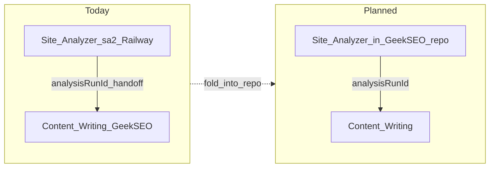

# Frase Feature Parity Assessment

**Status:** Assessment (June 2026)  
**Related:** [`TODO.md`](TODO.md), [`PROJECT_STATUS.md`](../PROJECT_STATUS.md), [`docs/research/competitor-analysis.md`](../docs/research/competitor-analysis.md) § Frase.io, [`IMPLEMENTATION-PLAN.md`](IMPLEMENTATION-PLAN.md)

## Short answer

**No.** Geek SEO covers many of the same *categories* as Frase (SERP research, briefs, editor scoring, GSC/GA4, site audit, brand voice, GEO probes, content monitoring), but it does **not** have full Frase parity. The repo itself states v1 checklist closure is **not** a claim of beating Frase in the editor ([`TODO.md`](TODO.md) line 13).

**Site Analyzer (production):** The **connected** Site Analyzer (Site Analyzer 2 / sa2) hands off to Content Writing via `analysisRunId` and is the live research → write path. **Planning:** fold that Site Analyzer into this repo so research and writing live in one product surface.

**Note:** The in-repo **10-step wizard** (`/site-analyzer`, `SiteAnalyzerStepService`) is a **transitional** `geek_seo` pipeline — not the canonical Site Analyzer product and not what Content Writing uses today. Do not describe it as “Site Analyzer disconnected from Content Writing.”

---

## What Frase ships (reference)

From [`competitor-analysis.md`](competitor-analysis.md) § Frase.io:

| Frase capability | Frase positioning |
|------------------|-------------------|
| SERP research + competitor scrape | Core brief input |
| **Brief-first workflow** | Primary differentiator |
| Editor with **SEO + GEO dual score** | Real-time optimization |
| **Frase AI Agent** (80+ skills) | Writing/research assistant |
| **Multi-LLM AI visibility** | ChatGPT, Perplexity, Claude |
| Site audits | Technical SEO |
| Brand voice profiles | AI tone training |
| **API + MCP** on all plans | Developer workflows |

---

## Geek SEO vs Frase — feature matrix

| Frase feature | Geek SEO status | Evidence / gap |
|---------------|-----------------|----------------|
| SERP research | **Partial / strong in places** | sa2 research pack → Content Writing; deep SERP analyzer (`/app/serp`); transitional in-repo 10-step wizard |
| Competitor analysis | **Yes** | sa2 export + Content Writing insights rail; competitor crawl in editor |
| Content brief generator | **Yes (v1)** | `/app/briefs/new`, guided flow — not documented as Frase-depth brief quality |
| Brief → draft → optimize loop | **Yes** | Guided wizard, full article job, Content Writing draft pipeline |
| Real-time content editor + score | **Yes** | SignalR scoring, editor workspace |
| **SERP-grounded NLP term scoring** | **Weak (known gap)** | v1 uses keyword word-split; [`TODO.md`](TODO.md) Scoring & editor P0–P1, [`IMPLEMENTATION-PLAN.md`](IMPLEMENTATION-PLAN.md) § 1.3 |
| **SEO + GEO dual score** | **Yes (partial)** | Shipped per PROJECT_STATUS #21–23; GEO is not Frase-level multi-platform |
| **Frase AI Agent (80+ skills)** | **No** | No agent/skills surface; toolbar actions (humanize, detect, auto-optimize) only |
| AI article / outline / paragraph writing | **Yes** | Content Writing, bulk, guided |
| **PAA tab → click-to-insert H2** | **No** | PAA shown read-only in `research-insights-rail.tsx`; planned in IMPLEMENTATION-PLAN Phase 2.1 |
| Brand voice profiles | **Yes** | `/app/brand-voice` |
| Site audit | **Yes** | `/app/audit` (Playwright crawl) |
| GSC + GA4 | **Yes** | Rankings + analytics (Google OAuth) |
| Content monitoring / decay | **Yes** | Content Guard + published audit |
| **AI visibility (ChatGPT, Perplexity, Claude)** | **No** | Only Google AIO/organic probe — parity #20 waived in [`TODO.md`](TODO.md) |
| Keyword research / topical map | **Beyond Frase** | Planner, keywords, niche analyzer, topical map — Frase is weaker here per competitor doc |
| Cannibalization | **Beyond Frase** | `/app/cannibalization` |
| Internal linking | **Yes** | Editor panel + auto-insert |
| Plagiarism | **Yes** | Copyscape optional |
| WordPress publish | **Code yes, prod unverified** | Waiver #15 |
| **Public API** | **No** | Parity #31 backlog |
| **MCP access** | **No** | Not in roadmap |
| Chrome extension / Google Docs | **No** | Parity #28–30 backlog |
| Frase-style nav (Create / Site / Analyze) | **Shell only** | `sidebar-navigation.ts` — many links are `#` placeholders |

**Bottom line for Geek SEO:** Roughly **60–70% category overlap** with Frase at v1, but missing or weaker on Frase's headline differentiators: **deep SERP term scoring**, **AI Agent**, **multi-LLM visibility**, **PAA-driven editor workflow**, **API/MCP**, and several **integration surfaces**.

---

## Site Analyzer — architecture (corrected)

### Canonical product today: Site Analyzer 2 (sa2)

- **Connected to Content Writing:** `analysisRunId` handoff is live — `ContentWriterHandoffService`, `content-writing-search-params.ts`, research insights rail (“Live from sa2”).
- **Where it runs:** Separate Railway **Site Analyzer** service + `sa2` schema (`SITE_ANALYZER2_DATABASE_URL`); GeekSeoBackend consumes exports via `HttpAnalysisRunRepository` and `HttpSiteAnalyzer2SiteProfileRepository`.
- **Frase-like loop:** Site crawl → keyword/SERP research pack → **Write article** → Content Writing draft/score. This path **works**; the gap is **repo/UI consolidation**, not a broken handoff.

### Transitional: in-repo 10-step wizard (Geek-SEO)

- **What it is:** Early `geek_seo` implementation (`/site-analyzer`, `SiteAnalyzerStepService`) — site index + keyword pack on `seo_url_research` / `seo_site_research`.
- **Not canonical:** Content Writing rejected `urlResearchId`; this wizard is **not** the production Site Analyzer and should not be scored as “Site Analyzer disconnected from Content Writing.”
- **Disposition (planning):** Retire or merge useful step logic when sa2 is folded into this repo — do not treat wiring step 10 to Content Writing as the primary fix.

### Planned: fold Site Analyzer into Geek-SEO

| Goal | Outcome |
|------|---------|
| Single repo | Site Analyzer wizard, `sa2` persistence, and Content Writing in **Geek-SEO** |
| Single UX | Research → finalize → open Content Writing without a separate Railway app |
| One handoff contract | Keep `analysisRunId` (or successor) as the frozen research pointer |

### Frase-like research capabilities (sa2 — production path)

| Capability | sa2 + Content Writing (today) |
|------------|-------------------------------|
| Site crawl + business context | `site_profiles` export |
| SERP snapshot (organic, PAA, PASF) | `content-writer-export` |
| Competitor crawl | Export-driven |
| Term benchmarks | Frozen pack → scoring context |
| Structure / FAQs | Export + draft enrichers |
| Merge site + keyword context | Site profile + analysis run |
| Open Content Writing | `analysisRunId` deep link — **connected** |

---

## What the project already admits is incomplete

From [`PROJECT_STATUS.md`](../PROJECT_STATUS.md) and [`TODO.md`](TODO.md):

- Editor scoring is **v1 math** — thin SERP term coverage vs Surfer/Frase
- REDESIGN **Phase 7**: “Editor research rail (Frase-style) + Copilot” — **deferred**
- Scoring v2, PAA rail, enhanced brief — [`IMPLEMENTATION-PLAN.md`](IMPLEMENTATION-PLAN.md) Phases 1.3 and 2.1
- Parity **#28–31** (WP plugin, Chrome, Docs, public API) — **not built**
- Multi-LLM GEO — **not built** (#20 waiver)

---

## Recommended priorities if goal is “Frase parity”

1. **Fold Site Analyzer into Geek-SEO** — Move sa2 wizard + persistence into this repo; one app for research → Content Writing (primary structural gap vs Frase brief-first UX).
2. **Scoring v2** ([`TODO.md`](TODO.md) P0) — SERP term set + term table; closest gap to Frase editor experience.
3. **Frase-style research rail** (REDESIGN Phase 7) — PAA click-to-insert, missing-term workflow in sidebar.
4. **Multi-LLM GEO** — if matching Frase's AI visibility story matters.
5. **Public API (#31)** — Frase includes API on all tiers; MCP is optional unless explicitly required.
6. **Retire transitional 10-step wizard** — After sa2 fold-in, remove or archive `geek_seo` url-research wizard so docs and UI have one Site Analyzer story.

---

## Summary table

| Area | All Frase features? |
|------|---------------------|
| **Geek SEO (overall product)** | **No** — strong v1 checklist, weak on Frase differentiators |
| **Site Analyzer → Content Writing (sa2, production)** | **Connected** — `analysisRunId` handoff works; UI/repo split is the gap |
| **Site Analyzer in Geek-SEO repo** | **Planned** — fold external Site Analyzer into this project |
| **In-repo 10-step wizard** | **Transitional** — legacy `geek_seo` scaffold; not the canonical product |
| **Frase-style UI shell** | **No** — sidebar placeholders remain |

---

## Backlog items (from this assessment)

| ID | Work |
|----|------|
| fold-site-analyzer | Fold connected Site Analyzer (sa2) into Geek-SEO repo — wizard UI, persistence, and Content Writing in one product |
| retire-10-step-wizard | After fold-in, retire transitional in-repo 10-step `urlResearchId` pipeline |
| scoring-v2 | Implement SERP-grounded term scoring + editor term table ([`TODO.md`](TODO.md) P0/P1) |
| frase-research-rail | Ship REDESIGN Phase 7: Frase-style research rail with PAA insert and missing-term workflow |
| multi-llm-geo | Extend GEO beyond Google AIO to ChatGPT/Perplexity/Claude if matching Frase AI visibility |
| api-integrations | Public API (#31) and optional MCP if developer parity with Frase is required |
