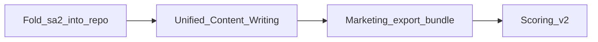

# Geek SEO — Implementation Plan

**Status:** Active (June 2026)  
**Granular backlog:** [`TODO.md`](TODO.md)  
**Shipped status:** [`PROJECT_STATUS.md`](../PROJECT_STATUS.md)

This file is the **ordered build sequence**. `TODO.md` holds checklist detail (tests, env, waivers).

---

## Phase 1 — Content loop (P0)

| # | Work | Spec | Done when |
|---|------|------|-----------|
| **1.1** | Fold Site Analyzer (sa2) into Geek-SEO | [`SITE-ANALYZER-FOLD-IN.md`](SITE-ANALYZER-FOLD-IN.md) | Single app: research wizard → `analysisRunId` → Content Writing |
| **1.2** | Unify Content Writing on frozen sa2 pack | [`FRASE-PARITY-ASSESSMENT.md`](FRASE-PARITY-ASSESSMENT.md) | One pipeline for brief → outline → draft → score; no niche backfill for keyword articles |
| **1.5** | Marketing export bundle (geekatyourspot handoff) | [`CONTENT-WRITER-MARKETING-EXPORT.md`](CONTENT-WRITER-MARKETING-EXPORT.md) | Operator copies validated 5-asset bundle; manual paste to geekatyourspot |
| **1.3** | Scoring v2 — SERP term set + editor term table | [`TODO.md`](TODO.md) § Scoring & editor | Score moves when specific SERP terms are added |
| **1.4** | Retire transitional 10-step `urlResearchId` wizard | After 1.1 | No duplicate Site Analyzer story in UI or docs |

**Order:** 1.1 → 1.2 → 1.5 → 1.3; retire 10-step wizard after 1.1.

---

## Phase 2 — UX + platform depth

| # | Work | Reference |
|---|------|-----------|
| **2.1** | Frase-style research rail (PAA insert, missing terms) | `TODO.md` REDESIGN Phase 7 |
| **2.2** | Niche Analyzer artifact paradigm — Tier A suggestions, approve/patch, reset | [`NICHE-ANALYZER-ARTIFACT-PARADIGM.md`](NICHE-ANALYZER-ARTIFACT-PARADIGM.md) |
| **2.3** | `IKeywordDiscoveryProvider` real impl (provider Phase B) | [`KEYWORD-DISCOVERY-STRATEGY.md`](KEYWORD-DISCOVERY-STRATEGY.md) |

---

## Phase 3 — Growth + deferred

| # | Work | Reference |
|---|------|-----------|
| **3.1** | Topical map V2.2 market opportunities | `TODO.md` §12b |
| **3.2** | Local service area phases 2–4 | [`LOCAL-SERVICE-AREA.md`](LOCAL-SERVICE-AREA.md) |
| **3.3** | Multi-LLM GEO (parity #20 waiver) | [`FRASE-PARITY-ASSESSMENT.md`](FRASE-PARITY-ASSESSMENT.md) |
| **3.4** | Integrations #28–31, ops P4, security P0 | `TODO.md` |

---

## Two-repo content publish loop

Site Analyzer + Content Writer live in **Geek-SEO**. Published marketing pages live in **geekatyourspot** (manual paste). See [`CONTENT-WRITER-MARKETING-EXPORT.md`](CONTENT-WRITER-MARKETING-EXPORT.md).

---

## Retired plans (merged here)

Absorbed into this file + `TODO.md` (June 2026): `CONTENT-WRITING-IMPROVEMENT-PLAN`, `CONTENT-WRITER-FEATURES`, `TopicalMapUpgrade`, `NICHE-SCALABLE-PERSISTENCE`, `LOCAL-SERVICE-AREA-IMPLEMENTATION`.
