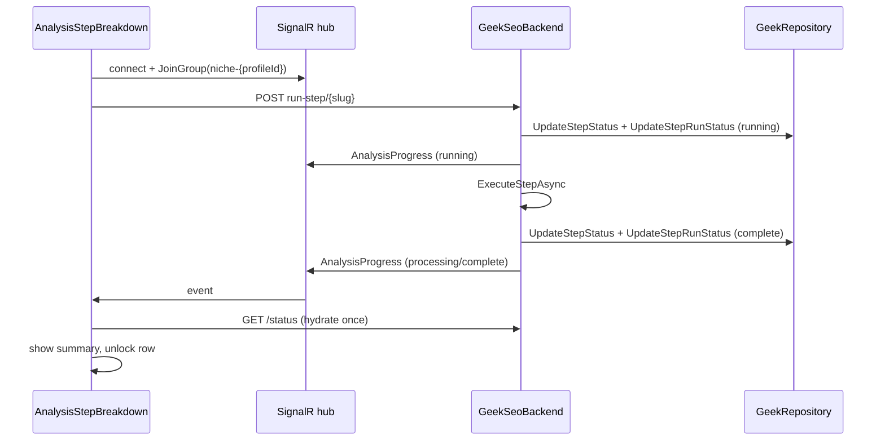

# Niche Analyzer — Session Handoff (June 2026)

**Purpose:** Pick up manual step-by-step niche analysis after the 16-step split, SignalR wait path, and step-run sync fix.  
**Branch:** `main` @ `16b4495` (pushed to `origin/main`)  
**Operator context:** Dev-only; no production customers. Step 1 (`schema`) was tested and initially timed out; root cause identified and fixed.

---

## What shipped (commits)

| Commit | Summary |
|--------|---------|
| `50dc5b1` | **16-step pipeline** — split old step 6 `site_structure` into `site_crawl` (6), `internal_links` (7), `url_patterns` (8); renumber 9–16. SignalR wait replaces 400ms poll on manual Run. `NicheAnalysisProgressNotifier` (retry + User + Group push). Hub `JoinGroup`. |
| `47e6d17` | **UI race mitigation** — hydrate after hub connect; terminal DB status wins over optimistic “running”; sparse reconcile timers during wait. |
| `16b4495` | **Step-run sync fix** — manual reruns wrote legacy `step-status` JSON but `GET /status` read stale `niche_profile_step_runs` rows → client never saw `complete` → 2 min timeout. Added `NicheStepRunStatusWriter` + merged status read. Hub connects **before** `POST run-step`. |

Earlier (same sprint): `dba8c15`, `6cce52d` — one-click Run waits for completion; background scoped context + persisted errors.

---

## Architecture (unchanged boundaries)

```
Browser (Vercel) → GeekSeoBackend :5051 (SignalR + run-step)
                → GeekAPI → GeekRepository → Railway Postgres (geek_seo)
```

- **GeekSeoBackend has NO direct DB access.** All writes via HTTP repos.
- **Auth:** GeekOAuth → Railway Postgres (`asp_net_users`). **Not Supabase.**
- **Vendor cache:** `seo_serp_results`, `seo_keyword_vendor_snapshots` — never wipe on profile reset.

See [`NICHE-ANALYZER-ARTIFACT-PARADIGM.md`](NICHE-ANALYZER-ARTIFACT-PARADIGM.md) for locked product decisions.

---

## 16-step catalog (current)

| # | Slug | Title | Notes |
|---|------|-------|-------|
| 1 | `schema` | Schema.org | Fast; HTTP fetch (no browser on manual run) |
| 2 | `site_urls` | Site URLs | |
| 3 | `nav` | Navigation | Optional |
| 4 | `headings` | Homepage headings | |
| 5 | `page_content` | Page content | |
| 6 | `site_crawl` | Site crawl | Max **20 pages**; 300s client wait timeout |
| 7 | `internal_links` | Internal links | Reads crawl artifacts |
| 8 | `url_patterns` | URL patterns | |
| 9 | `merging` | Topic selection | |
| 10–11 | `keywords`, `serp_validation` | Optional validate | |
| 12–15 | `profile`, `local`, `coverage`, `scoring` | Synthesize | |
| 16 | `complete` | Terminal | |

Source of truth: `GeekSeoBackend/Services/NicheStepRunners/NicheStepCatalog.cs`.

---

## Manual Run flow (post-fix)



**No interval polling** on manual wait. Acceptable reconciles: one hydrate on terminal event, on reconnect, on hub connect, and sparse timers during active wait only.

### Key files

| Layer | File |
|-------|------|
| Wait (client) | `frontend/src/lib/niche-step-wait.ts` |
| Run UI | `frontend/src/components/niche-analyzer/AnalysisStepBreakdown.tsx` |
| Full-run listener (not mounted on page) | `frontend/src/components/niche-analyzer/AnalysisStatusListener.tsx` |
| Push + retry | `GeekSeoBackend/Services/NicheAnalysisProgressNotifier.cs` |
| Step-run sync | `GeekSeoBackend/Services/NicheStepRunStatusWriter.cs` |
| Manual rerun | `GeekSeoBackend/Services/NicheStepRerunService.cs` |
| Status merge read | `GeekSeoBackend/HttpClients/Repo/HttpNicheProfileRepository.cs` → `GetStepStatusesAsync` |
| Hub group join | `GeekSeoBackend/Hubs/SeoContentScoringHub.cs` → `JoinGroup` |
| Run endpoint | `GeekSeoBackend/Controllers/Seo/NicheAnalyzerController.cs` → `POST .../run-step/{slug}` |

---

## Bugs found & fixed this session

### 1. Step 1 “IN PROGRESS” then timeout (120s)

**Symptom:** `Timed out waiting for step "schema" to finish.`

**Root cause:** `GetStepStatusesAsync` preferred relational **step-runs** when any rows existed (16 seeded as `pending` on reset). Manual rerun only updated **legacy step-status JSON** via `UpdateStepStatusAsync`, not step-run rows. Client wait checked `stepStatuses.schema` → never `complete`.

**Fix:** `NicheStepRunStatusWriter.SyncAsync` on every running/complete/error in `NicheStepRerunService` (+ worker path in `NicheAnalyzerService.PushProgress`). Merge JSON + step-runs in `GetStepStatusesAsync` with status rank (complete > running > pending).

### 2. SignalR race (fast steps)

**Symptom:** Step finished on server; UI stuck until timeout.

**Cause:** `POST run-step` returned before hub subscribed; complete event missed.

**Fix:** `triggerRun` in `waitForNicheStepViaSignalR` — connect + `JoinGroup` **then** POST. Reconcile hydrates at 1s/3s/8s and after join. UI prefers terminal status from parent poll over optimistic running.

### 3. Misleading old timeout

Old `pollStepUntilTerminal` used 120s (300s for crawl) while server allows 30 min. Removed poll loop entirely for manual Run.

---

## Deploy checklist

Manual **GeekSeoBackend** redeploy on Railway required (frontend auto-deploys from `main`).

1. Confirm Railway GeekSeoBackend on **`16b4495`** or later.
2. Confirm **GeekRepository** running (step-run PATCH endpoints must exist — same repo pin as persistence package).
3. Smoke: `GET /health` on GeekSeoBackend.
4. In app: Niche Analyzer → Run Step 1 → should complete in **seconds** with live message, not 2 min timeout.
5. Optional: SignalR — browser devtools → WS to `/hubs/seo-scoring`; see `AnalysisProgress` events.

**Env (unchanged):** `GEEK_API_URL`, JWT via GeekOAuth, `NEXT_PUBLIC_SEO_API_URL` / `NEXT_PUBLIC_SEO_SIGNALR_URL` on Vercel.

---

## Not done / backlog

| Item | Notes |
|------|-------|
| **Mount `AnalysisStatusListener`** on niche analyzer page | Built for full re-analyze flow; page still uses parent poll (3s when any step running). |
| **Delete all niche analyzer DB data** | User requested wipe; SQL not executed. Safe pattern: delete `geek_seo.niche_profiles` (cascade) + niche-related `seo_background_jobs`; **do not** delete vendor cache tables. |
| **Reset analysis UI** | Hidden until full wipe implemented (`110e7cd`). |
| **Playwright on manual run-step** | Controller passes `browser: null`; nav step may differ prod vs worker. |
| **GeekRepository deploy** | Required when `GeekSeo.Persistence` / step-run API changes; pin in GeekBackend repo. |
| **Profiles on old 14-step slug `site_structure`** | Re-enqueue or reset; loader has legacy fallbacks in `NicheStepRelationalLoader`. |
| **EF migration apply** | `20260613210130_AddNicheProfilePhase1RelationalStepTables` (+ phase 2 if present) on Railway if not already applied. |
| **Tier A Step 1 suggestions UI** | Per artifact paradigm doc — not built. |

---

## Infrastructure notes (not Geek SEO)

### Supabase org restricted (357 GB / 5 GB egress)

- **Geek SEO does not call Supabase** (no client in this repo).
- Niche data + auth path: **Railway Postgres** only.
- Supabase egress explosion is almost certainly **another project in the org** (polling, storage, leaked anon key, CI). Fix billing/usage separately.
- **Supabase MCP for Cursor:** hosted server uses **OAuth** (dynamic client registration) — no PAT required. Config: `https://mcp.supabase.com/mcp?project_ref=...&read_only=true`, then **Settings → Tools & MCP → supabase → Connect**. PAT (`sbp_...` in `Authorization` header) is only for CI or clients that cannot do browser OAuth. Org restriction may block MCP until quota resolved.

### Tests

```bash
dotnet build GeekSEO.slnx
dotnet test GeekSEO.slnx --filter "FullyQualifiedName~NicheStepCatalogTests|FullyQualifiedName~NicheAnalyzerServiceCanonicalProfileTests"
```

Pre-existing failures: `SeoProviderRegistrationTests` (missing `SEO_VENDOR_SERP_CACHE_DAYS` in test env).

---

## Verification script (operator)

1. Open `/app/strategy/niche-analyzer` with a project that has a pending/manual profile.
2. Run **Step 1 Schema.org**.
3. Expect: live progress text → complete within ~5–30s (domain dependent).
4. `GET /api/seo/niche-analyzer/{profileId}/status` → `stepStatuses.schema` = `complete`, summary populated.
5. Run Step 2; confirm dependency gate works (Step 1 must be complete).

If timeout persists after deploy `16b4495`:

- Check GeekRepository logs for failed `PATCH .../step-runs/{slug}/status`.
- Check GeekSeoBackend logs for `Step re-run` / `Could not sync step run row`.
- Confirm profile not stuck with lock (`Another step is already running`).

---

## Related docs

- [`NICHE-ANALYZER-ARTIFACT-PARADIGM.md`](NICHE-ANALYZER-ARTIFACT-PARADIGM.md) — read-from-DB default, execute on approval
- [`SITE-NICHE-ANALYZER.md`](SITE-NICHE-ANALYZER.md) — feature spec
- [`PROJECT_STATUS.md`](../PROJECT_STATUS.md) — roadmap
- [`CLAUDE.md`](../CLAUDE.md) — repo boundaries, session notes

---

*Last updated: 2026-06-14 — session handoff after SignalR wait + step-run sync fix.*
