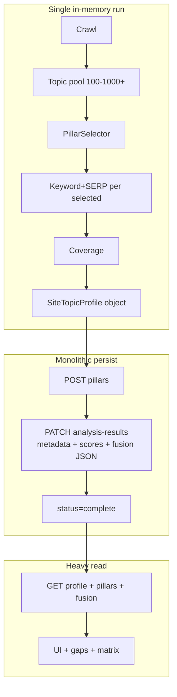
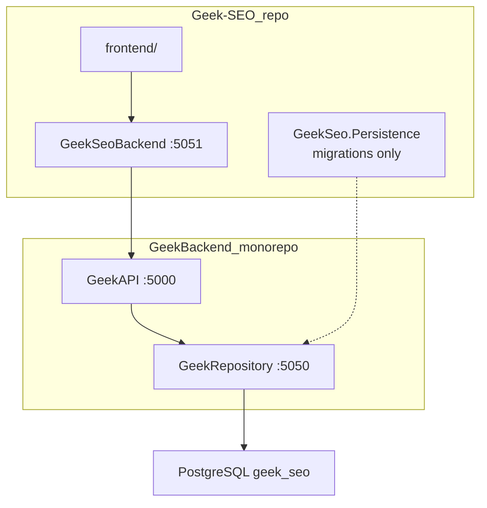
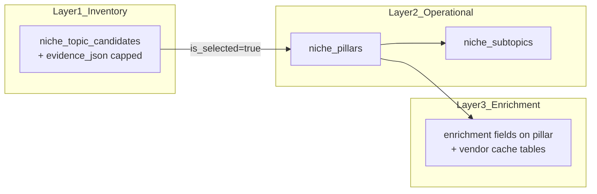
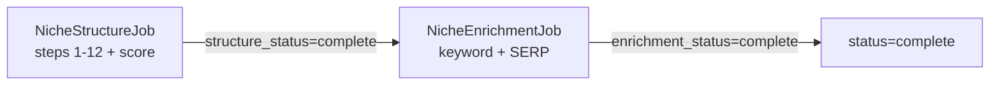

# Niche Analyzer — Scalable Persistence Plan

> **Status:** Critique incorporated (2026-06-07) — ready for execution planning  
> **Context:** Production re-analyze fails at step 13 (~100s timeout on fat `PATCH analysis-results`). Fusion JSON trim (`e32f5ab`) did not unblock.  
> **Related:** [`SEARCH-UNDERSTANDING-LAYER.md`](SEARCH-UNDERSTANDING-LAYER.md), [`SITE-NICHE-ANALYZER.md`](SITE-NICHE-ANALYZER.md), [`ARCHITECTURE.md`](ARCHITECTURE.md), [`BOUNDARIES.md`](../BOUNDARIES.md)

## Purpose

Redesign how niche analysis **saves and reads** topic data so that:

1. State **outlives the worker process** incrementally (true persistence in the CS sense).
2. Large sites (100–1000+ topics) complete without one monolithic HTTP/jsonb payload.
3. **Every topic is kept** — no arbitrary pillar caps; scale via architecture, not deletion.
4. Separate processing phases are OK (structure can complete before enrichment finishes).

---

## Constraints (product)

| Constraint | Implication |
|------------|-------------|
| Every discovered topic must be retained | Inventory layer stores selected **and** excluded topics + reasons |
| Separate processing OK | Structure complete ≠ enrichment complete; two sub-statuses |
| No re-introducing pillar caps | Batch APIs + pagination, not `Take(N)` in selector |
| Geek-SEO has no `DATABASE_URL` | Schema authored here; SQL executed in **GeekRepository** only |

---

## Problem statement

### What fails today

| Symptom | Likely cause |
|---------|--------------|
| UI stuck at step 12 | Coverage finished **in RAM**; step 13 save never completes |
| `PATCH analysis-results` ~100s then 500 | Serialize huge `FusionSnapshot` → HTTP → jsonb write exceeds GeekRepository/GeekAPI limits |
| `GET niche-profiles/{id}` 503 during save | Concurrent read/write of same fat profile row |
| `gaps` / `coverage-matrix` 500 | Dapper analytics paths break at large pillar counts |
| JSON trim insufficient | Still one late monolithic write, not incremental persistence |

### Root cause (one diagram)



**Code anchors:** [`NicheAnalyzerService.cs`](../GeekSeoBackend/Services/NicheAnalyzerService.cs) step 13, [`NicheProfile.FusionSnapshot`](../GeekSeo.Persistence/Entities/NicheAnalysisEntities.cs), [`HttpNicheProfileRepository.SaveAnalysisResultsAsync`](../GeekSeoBackend/HttpClients/Repo/HttpNicheProfileRepository.cs).

---

## Persistence (computer science) vs what we do today

**Definition:** persistence = data/state **outlives the process** that created it (durable storage, not RAM).

| When | What | Outlives worker? | Where |
|------|------|------------------|-------|
| Steps 1–12 | `SiteTopicProfile fused`, crawl, enrichment | **No** | Worker heap |
| Each step | `UpdateStatusAsync` + step log | **Yes** | Postgres (small) |
| Vendor cache | SERP/keyword snapshots | **Yes** | Postgres |
| Step 13 start | `BulkInsertPillars` / subtopics | **Yes** | Postgres (relational) |
| Step 13 fail | `SaveAnalysisResultsAsync` + `FusionSnapshot` | **Often no** (~100s timeout) | Postgres jsonb |
| UI GET | Full profile deserialize | N/A | RAM again on every request |

The pipeline is **memory-first, late-persist** for the expensive graph. That explains timeouts and “stuck at 12” — not slow Postgres alone, but moving a multi‑MB object through memory → JSON → network → jsonb, then reading it back on GET.

### Design principle: right tool, not one hammer

| Job | Wrong tool (today) | Right tool (plan) |
|-----|-------------------|-------------------|
| Hot UI reads | Megabyte jsonb on every GET | Paginated relational queries |
| Write 100–1000 topics | One PATCH | Batch INSERT + small PATCHes |
| Long enrichment | Block in one 15‑min job | Resumable phase + vendor cache |
| Provenance / audit | Duplicate in fusion JSON | **Capped `evidence_json` on candidate row** (see Evidence strategy) — not a row-per-snippet table by default |
| Debug archive | On critical path | Optional `fusion-snapshot` **last** |
| Gaps / coverage matrix | Dapper over denormalized blob | SQL on normalized pillars; paginate |

---

## Terminology (avoid confusion)

### Three “repository” meanings

| Term | Meaning |
|------|---------|
| **Data repository** (enterprise) | Centralized dataset infrastructure — **not** any of our services |
| **GeekRepository** (deployable) | Application persistence service — SQL for `geek_seo` only (`:5050`) |
| **`HttpClients/Repo/`** (Geek-SEO) | HTTP client abstractions calling GeekAPI → GeekRepository |

**GeekBackend** = sibling **monorepo name** (hosts GeekAPI + GeekRepository). It is **not** the persistence tier.

### “Persistence” overload

| Term | Meaning |
|------|---------|
| **`GeekSeo.Persistence`** | Schema project (entities + migrations); does not run SQL in production from GeekSeoBackend |
| **Runtime save/load** | GeekRepository → Postgres via HTTP |
| **`SerializeForPersistence()`** | Trim JSON before wire transfer |

### Runtime flow



---

## Target model: three layers



| Layer | Purpose | Scale tactic |
|-------|---------|--------------|
| **Inventory** | All topics + exclusion + provenance | Paginated API; **candidates first**, evidence optional/lazy; batch UPSERT 100–200 |
| **Operational** | TopicalMap, gaps, calendar inputs | Normalized rows; indexed by `profile_id` |
| **Enrichment** | Vendor metrics per topic | **Separate `NicheEnrichmentJob`**; resume cursor; vendor cache skips work |

**`FusionSnapshot` jsonb** → archive only; read-disabled → write-disabled → retained ≥1 release for rollback (Phase 4).

---

## Data ownership (source of truth)

During migration, **one writer and one reader per concern** — no dual-read/dual-write drift.

| Data | Source of truth (after Phase 4) | Hot-path reads | Notes |
|------|--------------------------------|----------------|-------|
| Discovered topics | `niche_topic_candidates` | Paginated GET | Includes selected + excluded |
| Provenance / evidence | `niche_topic_candidates.evidence_json` (capped jsonb) | Candidate detail / matrix expand | Not normalized evidence rows by default |
| Selected pillars | `niche_pillars` | Paginated GET | FK optional to `candidate_id` |
| Subtopics | `niche_subtopics` | With pillars or paginated | |
| Coverage status | `niche_pillars.coverage_status` + subtopic rows | Gaps, matrix | Computed in structure job |
| Keyword / SERP metrics | `niche_pillars` enrichment columns | Pillar table, TopicalMap | Filled by enrichment job |
| Authority / counts | `niche_profiles` score columns | Profile summary | Structure job writes scores |
| Step progress | `niche_profiles` status + step log | analysis-details | |
| Vendor raw payloads | `seo_serp_results`, keyword cache tables | Providers only | Already durable |
| **`FusionSnapshot`** | **Archive only** | **None** (Phase 4+) | Rollback / debug; not UI |

**Migration rule:** When Phase 2 ships, UI and APIs **stop reading** `fusion_snapshot`. Relational tables are authoritative. Fusion column remains for backfill/rollback until Phase 4 write-disable.

---

## Completion contracts (explicit)

Avoid ambiguous UI (“complete” but gaps 500). Two independent flags on `niche_profiles`:

### `structure_status = complete`

All of the following must be true:

| Requirement | Verified by |
|-------------|-------------|
| All topic candidates UPSERTed for this run | `COUNT(candidates) >= expected` from selector |
| Pillar rows saved for all `is_selected=true` | `COUNT(pillars)` matches selected count |
| Subtopics saved | batch POST success + row count check |
| Coverage computed and on pillar rows | `coverage_status` populated |
| Profile summary patched | primary niche, tags, audience, timestamps |
| Scores patched | authority + covered/partial/gap counts |
| `structure_status` set | explicit PATCH |

**Does not require:** keyword volume, SERP validation, or enrichment columns.

**UI when structure complete:** inventory matrix, pillar table, coverage matrix, gaps (if analytics fixed). Show enrichment as in-progress if vendor phase pending.

### `enrichment_status = complete`

| Requirement | Verified by |
|-------------|-------------|
| Every selected pillar has `enrichment_status` ∈ `{done, skipped, failed}` | no `pending` rows |
| Keyword fields filled where provider available | nullable when skipped |
| SERP fields filled where provider available | nullable when skipped |

**UI when enrichment complete:** full keyword/SERP columns; “enrichment” progress bar done.

### `status = complete` (legacy / overall)

Set only when **`structure_status = complete` AND `enrichment_status = complete`** (Phase 3+). Until then, use sub-statuses for honest UX.

---

## Evidence strategy (revised — avoid new row explosion)

**Risk:** Normalized `niche_topic_evidence` with 1000 topics × 5–10 snippets × re-analyzes → millions of rows — a new FusionSnapshot.

**Decision:**

1. **Step 7 persist order:** UPSERT **candidates only** (no evidence batch in same critical path).
2. **Evidence storage:** **`evidence_json` jsonb** on `niche_topic_candidates` — capped array (e.g. max **5** items, **120** char snippet each, source + url + weight). JSONB is appropriate here: provenance is read with the candidate, not joined at scale.
3. **Evidence write timing:** After candidates durable, either:
   - lazy PATCH per batch (lower priority), or
   - on-demand when user expands provenance in UI (future optimization).
4. **Drop default `niche_topic_evidence` table** from Phase 2 unless a concrete query requires row-level evidence analytics (none identified today).

**Write amplification at step 7:** 1000 candidates = **1000 rows**, not 6000 — acceptable with batch UPSERT. Evidence adds bounded jsonb per row, not N extra tables.

---

## Phased analyze pipeline (checkpoints)

Replace “steps 1–14 then one save” with durable checkpoints:

| Phase | Steps | Computes | Persists |
|-------|-------|----------|----------|
| **A — Discover** | 1–6 | crawl, schema, pool | step log (existing) |
| **B — Select** | 7 | `PillarSelector` | **UPSERT candidates only** (no evidence in critical path); optional lazy `evidence_json` after |
| **C — Structure summary** | 10–11 | niche tags, local geo | PATCH profile-summary |
| **D — Enrich** | 8–9 | keyword/SERP | **`NicheEnrichmentJob`** batch PATCH pillars; `enrichment_status` per row |
| **E — Coverage** | 12 | matcher | subtopics batch; pillar coverage fields |
| **F — Score** | 13 | authority | PATCH scores |
| **G — Structure complete** | 14a | — | `structure_status=complete`; gaps UI enabled |
| **H — Enrichment complete** | 14b | — | `enrichment_status=complete`; then `status=complete` |

**Job split (Phase 3):**



Structure job must finish for ~1000 topics; enrichment job is queueable, resumable, and may lag without blocking inventory/coverage UX.

---

## Database schema (authored in Geek-SEO)

New tables in `geek_seo`:

### `niche_topic_candidates`

- `id`, `niche_profile_id`, `slug`, `name`, `confidence`, `is_selected`, `exclusion_reason`, `dedicated_page_url`, `internal_link_count`, `content_depth_score`, `display_order`
- **`evidence_json`** jsonb — capped array (max 5 items, 120-char snippets); provenance source of truth
- Unique: `(niche_profile_id, slug)`
- Index: `(niche_profile_id, is_selected)`

~~### `niche_topic_evidence`~~ — **removed from default design** (row-per-snippet explosion risk). Use `evidence_json` unless future analytics require normalized rows.

### Changes to existing tables

**`niche_pillars`:** optional `candidate_id` FK; `enrichment_status` (`pending|done|skipped|failed`); `enriched_at`

**`niche_profiles`:** `structure_status`, `enrichment_status`, `scan_fingerprint`, `persist_stage`; keep `fusion_snapshot` for backfill, deprecate hot-path reads

Migrations: `GeekSeo.Persistence` in this repo. GeekRepository applies at startup.

---

## Scan fingerprint (run-to-run diff)

**Problem with binary hash:** one new sitemap URL → entirely different fingerprint → noisy UX.

**Store two fields on `niche_profiles`:**

| Field | Purpose |
|-------|---------|
| `scan_fingerprint` | Stable hash of core signals (domain, sul_version, sorted schema knowsAbout, nav labels, top-N sitemap URLs by priority) |
| `scan_change_score` | 0.0–1.0 Jaccard (or similar) vs prior run on full sitemap URL set + nav labels |

**UI messaging:**

| change_score | Message |
|--------------|---------|
| ≥ 0.95 | Site signals largely unchanged |
| 0.70–0.95 | Moderate structural drift |
| < 0.70 | Significant site change — expect topic drift |

Prior runs remain in history; `project/latest` points at current profile.

---

## Operational semantics

### Idempotency (all batch writes)

| Operation | Semantics |
|-----------|-----------|
| `POST .../topic-candidates/batch` | **UPSERT** on `(niche_profile_id, slug)`; safe retry |
| `PATCH .../pillars/batch` | UPSERT or PATCH by `pillar_id` |
| `POST .../subtopics/batch` | UPSERT on natural key |
| All batch requests | Optional **`Idempotency-Key`** header (profile_id + phase + batch_index) — GeekRepository returns same 200 on replay |

Network timeout after commit → retry must not duplicate rows or corrupt counts.

### Concurrency (re-analyze)

| Policy | Choice |
|--------|--------|
| One active structure job per `profile_id` | Worker claim `queued → processing`; second trigger **rejects** with 409 or queues new profile row |
| Re-analyze | Prefer **new profile version row** per run (existing history model); `DELETE`/soft-clear inventory only on explicit re-run of same id if product requires |
| Cross-worker | `processing` lock + stale fail (existing 15 min) prevents duplicate workers on same profile |

Document in API: starting analysis while `processing` returns conflict.

### Partial failure recovery

**Source of truth = database contents**, not `persist_stage` alone.

| `persist_stage` | Recovery validates |
|-----------------|-------------------|
| Hint only | Row counts: candidates ≥ expected; pillars == selected count; subtopics present; flags on profile |

On resume: read DB state → compute next batch index → continue. If `persist_stage = Coverage` but subtopic count low → rewind to subtopic batch, do not trust stage blindly.

### Backpressure

| Control | Setting |
|---------|---------|
| Worker dequeue | Existing `ListQueuedAsync(3)` per instance |
| Batches per profile | **Sequential** — no parallel batch POSTs for same profile |
| Enrichment job | Separate queue; max N enrichment jobs globally (config) |
| Inter-batch delay | Optional `NICHE_BATCH_DELAY_MS` between batch POSTs under load |
| GeekRepository | Rate limit or connection pool sizing (platform concern) |

Prevents five 1000-topic profiles from hammering Postgres with concurrent 5×5 batch storms.

---

## Internal API contract

GeekSeoBackend adds HTTP clients; **GeekRepository implements handlers**; **GeekAPI proxies only**.

| Endpoint | Body | Replaces |
|----------|------|----------|
| `PATCH .../profile-summary` | primaryNiche, description, tags, audience, analyzedAt, nextDue, totalPillarsIdentified | part of `analysis-results` |
| `PATCH .../scores` | authorityScore, covered, partial, gap | part of `analysis-results` (partially exists) |
| `POST .../topic-candidates/batch` | ≤200 rows; UPSERT | fusion `allCandidates` |
| `PATCH .../topic-candidates/evidence/batch` | ≤200; updates `evidence_json` only | fusion evidence — **optional, after candidates** |
| `PATCH .../pillars/batch` | keyword/coverage fields | inline in fat save |
| `PATCH .../fusion-snapshot` | optional trimmed archive | not on critical path |
| `GET .../topic-candidates?page=&limit=` | — | matrix UI |
| `DELETE .../topic-candidates?profileId=` | — | re-analyze cleanup |

### GeekRepository fixes (same rollout)

- Raise/remove ~100s timeout on large PATCH/GET; GeekAPI proxy timeout must match.
- Paginate profile GET or split `GET .../pillars?page=`.
- Fix niche-analytics `/gaps` and `/coverage-matrix` for large profiles.

---

## Geek-SEO code changes

| File | Change |
|------|--------|
| [`NicheAnalyzerService.cs`](../GeekSeoBackend/Services/NicheAnalyzerService.cs) | Checkpoint saves after step 7; batch enrichment; split saves; dual complete semantics |
| [`INicheProfileRepository`](../GeekSeo.Application/Interfaces/INicheProfileRepository.cs) | Batch + summary methods; deprecate `SaveAnalysisResultsAsync` |
| [`HttpNicheProfileRepository.cs`](../GeekSeoBackend/HttpClients/Repo/HttpNicheProfileRepository.cs) | New endpoint clients |
| [`NicheAnalysisJobWorker.cs`](../GeekSeoBackend/Workers/NicheAnalysisJobWorker.cs) | Split **`NicheStructureJob`** + **`NicheEnrichmentJob`**; resume via DB counts + cursor |
| [`NicheAnalyzerController.cs`](../GeekSeoBackend/Controllers/Seo/NicheAnalyzerController.cs) | Paginated topic-candidates route |
| [`frontend/.../niche-analyzer`](../frontend/src/app/app/strategy/niche-analyzer/page.tsx) | Defer gaps until complete; paginated matrix |
| [`SiteTopicProfilePersistence.cs`](../GeekSeo.Application/Models/Seo/SiteTopicProfilePersistence.cs) | Keep temporarily for optional archive; remove from hot path later |

---

## Rollout strategy

### Product vs engineering framing

**Product value (your bar):** Phases 1–3 alone are **not sufficient** — the redesign is only meaningful once **all four phases** are done (incremental persist, relational inventory, resumable enrichment, fat jsonb removed). Interim deploys are acceptable for **engineering and testing**, not as shippable product milestones.

**Engineering value (why phase anyway):** Smaller diffs are easier to test, review, and bisect when something breaks. Each phase should have its own verification checklist before moving on — but that does not mean the product is “done” until Phase 4.

| Phase | Product-complete? | Notes |
|-------|-------------------|-------|
| **1** — split PATCH + timeout | No | **Temporary mitigation** — fixes timeout symptom; architecture still jsonb hot path |
| **2** — relational inventory | No | **Most valuable architectural shift** — domain model matches business entities |
| **3** — `NicheEnrichmentJob` | No | Dedicated queueable job after structure complete |
| **4** — fusion deprecated | **Yes** | read-disabled → write-disabled → retain column ≥1 release for rollback |

**Dependency rule:** Phase 1 is still the **technical prerequisite** for fixing step 13 timeout; Phase 2 without Phase 1 does not help. Build order remains 1 → 2 → 3 → 4, but **communicate “complete” to users only after Phase 4** (or explicitly label interim as beta/internal if deployed earlier).

**Ultimate goal:** structure persists incrementally, UI reads relational inventory, enrichment resumes at scale, no fat `analysis-results` — **all four phases**.

---

## Rollout phases

### Phase 1 — Split saves + timeout (mitigation gate)

**Framing:** Symptom relief, not target architecture. Proves split PATCH path before Phase 2 inventory.

| Owner | Work |
|-------|------|
| GeekRepository | Split PATCH handlers; timeout fix; UPSERT semantics on batches |
| GeekAPI | Proxy new routes |
| GeekSeoBackend | Call split saves instead of fat `analysis-results` |
| Frontend | Defer gaps/coverage-matrix until `structure_status === 'complete'` (or legacy `complete` in Phase 1) |

### Phase 2 — Relational inventory (architecture gate)

**Most valuable phase** — moves from `SiteTopicProfile` blob to Profile → Candidates → Pillars → Subtopics.

| Owner | Work |
|-------|------|
| Geek-SEO | EF migration (`evidence_json` on candidates); entities |
| GeekRepository | Batch candidate UPSERT; paginated GET; idempotency keys |
| GeekSeoBackend | Persist candidates at step 7 (no evidence in critical path); lazy evidence PATCH |
| Frontend | Matrix reads `topic-candidates` API; data ownership: no fusion reads |

### Phase 3 — `NicheEnrichmentJob` (scale gate)

**Prefer dedicated enrichment job** over one mega-worker resuming multiple stages.

```text
NicheStructureJob  →  structure_status=complete
NicheEnrichmentJob →  enrichment_status=complete  →  status=complete
```

| Owner | Work |
|-------|------|
| GeekSeoBackend | Structure job ends after coverage + scores; enqueue enrichment |
| Worker | New job type + cursor; batch keyword/SERP; backpressure config |
| Frontend | Two progress indicators (structure vs enrichment) |

### Phase 4 — Gradual fusion deprecation (product-complete)

**Do not delete `fusion_snapshot` immediately.**

| Step | Action |
|------|--------|
| 4a | UI/API **read-disabled** — relational only |
| 4b | **write-disabled** — no new fusion writes |
| 4c | Retain column ≥ **1 release cycle** for rollback |
| 4d | Optional backfill script; then nullable column |

Remove fat `analysis-results` endpoint after 4b.

---

## Success criteria (product acceptance — after Phase 4)

Per-phase verification during build; **all rows below must pass before calling the redesign done.**

| Scenario | Pass |
|----------|------|
| geekatyourspot.com (~60 pillars) | Step 14 complete; gaps/matrix load; no 100s PATCH timeout |
| Synthetic 1000 candidates / 1000 selected | Structure phase completes; inventory paginated; enrichment resumable; no critical-path body > 1MB |
| Re-analyze stable site | `scan_change_score` ≥ 0.95; slug set largely stable |

---

## Critique incorporated (2026-06-07)

| Feedback | Response |
|----------|----------|
| Root cause = no durable checkpoints | Kept as north star; Phase 1 is mitigation only |
| Inventory vs operational split | Data ownership table; Phase 2 = main architecture win |
| Structure vs enrichment complete | Explicit completion contracts + separate job |
| Avoid pillar caps | Unchanged |
| Persist too early / write amplification | Candidates only at step 7; evidence lazy/capped jsonb |
| Evidence table → new bottleneck | **Dropped normalized evidence table**; `evidence_json` on candidate |
| Structure complete ambiguous | Contract table with verification rules |
| Binary fingerprint noisy | `scan_fingerprint` + `scan_change_score` |
| Idempotency | UPSERT + Idempotency-Key on all batches |
| Concurrency | One structure job per profile; reject duplicate |
| Partial failure | DB counts = truth; `persist_stage` is hint |
| Backpressure | Sequential batches; worker limits; optional delay |
| Phase 3 job model | **Dedicated `NicheEnrichmentJob`** |
| Phase 4 delete fusion | **Gradual deprecate**; retain ≥1 release |

---

## Open questions (remaining)

1. **Dual status UX:** One progress bar with sub-label vs two bars (structure / enrichment)?
2. **GeekRepository handoff:** Who implements sibling monorepo work; aligned deploy?
3. **Analytics fix timing:** Phase 1 parallel vs Phase 2 with relational pillars?
4. **Backward compatibility:** Lazy backfill on read vs one-time migration script for old fusion-only profiles?
5. **Re-analyze model:** Always new profile row vs clear-in-place on same id?

---

## Out of scope

- Re-adding pillar selection caps
- Direct Postgres from GeekSeoBackend
- Treating GeekBackend monorepo as a single “repository” deployable
- Redis / external queue (unless critique surfaces need)

---

## Implementation todos

| ID | Task | Phase |
|----|------|-------|
| plan-doc | This document | — |
| phase1-split-patch | Split PATCH + timeout; orchestration + frontend defer | 1 |
| schema-inventory | Migration (`evidence_json` on candidates) + GeekRepository batch UPSERT APIs | 2 |
| persist-step7 | Candidates at step 7; lazy evidence; paginated matrix API + UI | 2 |
| phase3-enrichment | `NicheStructureJob` + `NicheEnrichmentJob`; idempotency + backpressure | 3 |
| ops-semantics | Idempotency keys, concurrency policy, recovery validation | 1–3 |
| analytics-fix | gaps/coverage-matrix at scale | 1 or 2 |
| deprecate-fusion | Gradual read/write disable; retain column; backfill | 4 |
