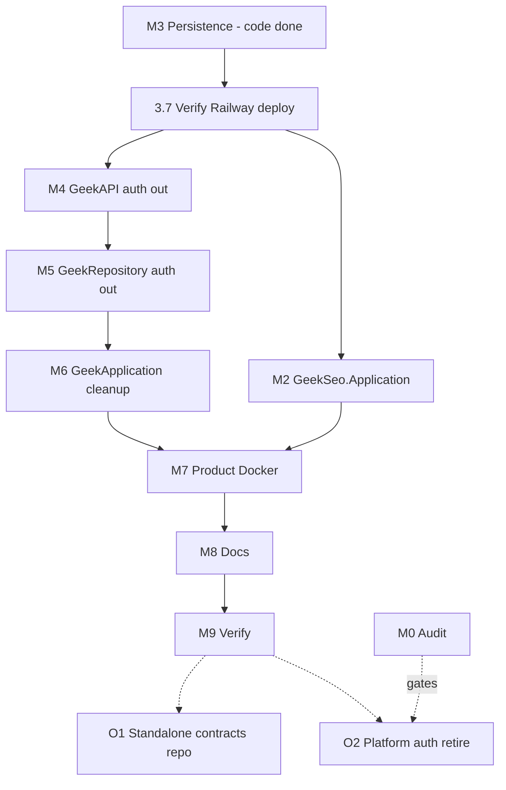

# Platform decoupling — Geek SEO contracts & legacy auth cleanup

**Status:** **M2 + M7 complete** in tree; **M4–M6 / M8–M9** next (M0 for O2)  
**Date:** 2026-05-30 (rev. 4)  
**Related:** [`ARCHITECTURE.md`](ARCHITECTURE.md), [`BOUNDARIES.md`](../BOUNDARIES.md), [`GEEKSEO-PLAN.md`](GEEKSEO-PLAN.md)

---

## Purpose

Geek SEO must **build and deploy without** cloning the GeekBackend monorepo or referencing a mixed `GeekApplication` DLL (SEO types + legacy platform auth in one assembly). GeekOAuth already handles login.

**Geek SEO owns its product processes** (see below). GeekRepository remains the **only runtime process** with Postgres credentials for schema `geek_seo`, but **schema evolution** (EF entities, `SeoDbContext`, migrations) lives in this repo (**M3**).

---

## Geek SEO owns product processes (mandatory principle)

| Process | Owner | Runs on |
|---------|-------|---------|
| Login / JWT issuance | **GeekOAuth** | auth service |
| Product HTTP + SignalR | **GeekSeoBackend** | Geek-SEO repo |
| Providers (DataForSEO, Claude, Playwright, WordPress REST) | **GeekSeoBackend** | Geek-SEO repo |
| Background workers (`FullArticleJobWorker`, etc.) | **GeekSeoBackend** | Geek-SEO repo |
| In-process scoring (`ContentScoringService`) | **GeekSeo.Application** | Geek-SEO repo (M2) |
| **Schema evolution** (`dotnet ef`, migrations, `SeoDbContext`) | **GeekSeo.Persistence** | **Geek-SEO repo (M3)** |
| SQL execution against `geek_seo` | **GeekRepository** | GeekBackend deploy (data plane only) |
| Internal SEO HTTP (`repo/seo/*`) | **GeekRepository** | GeekBackend deploy |

**Not owned by Geek SEO:** holding `DATABASE_URL` in production (still GeekRepository for connection pooling and platform S2S auth to the data tier).

---

## Terminology

| Term | Meaning |
|------|---------|
| **Geek SEO (product)** | This repo — UI, API, workers, **persistence definitions** (M3). |
| **GeekOAuth** | JWT issuer — not GeekApplication. |
| **GeekAPI** | Gateway — `/api/seo/internal/*` only for SEO data path. |
| **GeekRepository (service)** | Only process with **live** Postgres connection to `geek_seo`. |
| **GeekSeo.Persistence** | EF entities + `SeoDbContext` + migrations — **source of truth** for schema (M3). |
| **GeekApplication** | Legacy mixed library in GeekBackend — **transitional** until M2/M6. |

---

## Target end state

```
Browser → GeekOAuth → GeekSeoBackend (GeekSeo.Application)
                    → GeekAPI /api/seo/internal/*
                    → GeekRepository (repo/seo/*, no schema design)
                    → Postgres geek_seo
                           ↑ migrations applied from GeekSeo.Persistence (M3)
```

| Tier | Repo | Role |
|------|------|------|
| Identity | GeekOAuth | Tokens |
| Product | Geek-SEO | API, workers, Application, **Persistence (M3)** |
| Gateway | GeekAPI | Proxy |
| Data plane | GeekRepository | Execute SQL; reference **GeekSeo.Persistence** at build |

**GeekSeoBackend:** no GeekBackend clone in Docker (M7).  
**GeekRepository:** clones **Geek-SEO** at pin `Geek-SEO.commit` for Persistence only (M3 deploy) — inverse of today’s `GeekBackend.commit` on product.

---

## Mandatory phases

### M0 — Consumer audit (gate)

Unchanged. **Blocks O2 only** — does **not** block M3, M2, or M4–M9.

---

### M1 — Freeze legacy auth (optional safety net)

Unchanged.

---

### M3 — Product-owned persistence (**required** — was optional O3a)

**Goal:** `GeekSeo.Persistence` in Geek-SEO holds EF entities, `SeoDbContext`, and all `geek_seo` migrations. GeekRepository **references** this project; does not own schema design.

#### Status (rev. 3 audit)

| Step | Plan action | Status |
|------|-------------|--------|
| 3.1 | Add `GeekSeo.Persistence/` | **Done** — EF, Npgsql, `Entities/`, `Data/`, `Migrations/` |
| 3.2 | Move entities from `GeekApplication.Entities.Seo` | **N/A** — SEO entities were never in GeekApplication in current tree; they live only in `GeekSeo.Persistence` |
| 3.3 | Move `SeoDbContext`, factory, extensions | **Done** — `GeekSeo.Persistence/Data/` |
| 3.4 | Move `Migrations/Seo` from GeekRepository | **Done** — `GeekSeo.Persistence/Migrations/` (GeekRepository has SQL note only) |
| 3.5 | GeekApplication → `ProjectReference` GeekSeo.Persistence | **Done** — `GeekApplication.csproj` |
| 3.6 | GeekRepository → reference GeekSeo.Persistence | **Done** — `GeekRepository.csproj`; local `Data/Seo*` and `Migrations/Seo` removed |
| 3.7 | Deploy: `Geek-SEO.commit` + `Dockerfile.repository` clone | **Done** — Railway `SUCCESS` on `217f250` (Docker uses `GeekBackend/` subfolder for `../../Geek-SEO` paths) |
| 3.8 | `dotnet ef` from Geek-SEO | **Done** — `--project GeekSeo.Persistence --startup-project GeekSeo.Persistence` |

**Approach:** **O3a only** (not O3b). **Acknowledged DRY violation (already in codebase):** `GeekApplication` and `GeekRepository` both reference `GeekSeo.Persistence` at build time. Accept until **O1** (standalone contracts repo) if multi-app sharing is needed.

#### M3 Step 3.7 — urgent deploy verification

`GeekApplication.csproj` references `../../Geek-SEO/GeekSeo.Persistence/...`. Any Docker build that only `COPY`s GeekBackend folders **will fail** until Geek-SEO is present in the build context.

| Artifact | Geek-SEO clone? | Notes |
|----------|-----------------|-------|
| `Dockerfile.repository` (Railway doc target) | **Yes** — `Geek-SEO.commit` + shallow `git clone` | Updated in GeekBackend working tree |
| `GeekRepository/Dockerfile` | **No** | Legacy path; **broken** if Railway or local build uses this file — align service config to `Dockerfile.repository` or update this file in 3.7 |

**3.7 note:** Docker build context uses `/src/Geek-SEO` + `/src/GeekBackend/{GeekApplication,GeekRepository}` so `../../Geek-SEO` in csproj matches local sibling layout. `railway.toml` / `railway.json` set `dockerfilePath: Dockerfile.repository`.

#### `Geek-SEO.commit` ownership (GeekBackend repo)

Parallel to `GeekBackend.commit` in Geek-SEO.

| Event | Owner | Action |
|-------|-------|--------|
| Geek-SEO release that changes `GeekSeo.Persistence` (entities, migrations) | **Geek-SEO maintainer** | Merge to `main`; note commit SHA |
| Pin bump for GeekRepository deploy | **Same maintainer** (or paired PR) | Update `GeekBackend/Geek-SEO.commit` to that SHA; deploy GeekRepository |
| GeekBackend-only change (no Persistence change) | GeekBackend maintainer | No pin bump |

**Exit (M3):** `dotnet ef database update` from Geek-SEO; GeekRepository **production** build succeeds with pinned clone; E2E CRUD works.

**Supersedes** old “M3 duplicate types in GeekRepository” — single entity type assembly in Geek-SEO.

---

### M2 — SEO application layer in Geek-SEO (required)

**Goal:** GeekSeoBackend uses in-repo contracts only.

| Step | Action |
|------|--------|
| 2.1 | Add `GeekSeo.Application/` — interfaces, models, services, constants, `Results` |
| 2.2 | `ProjectReference` → `GeekSeo.Persistence` for entity types used in interfaces |
| 2.3 | Move `Services/Seo` (e.g. `ContentScoringService`) from GeekApplication |
| 2.4 | Remove GeekSeoBackend → GeekApplication reference |
| 2.5 | `dotnet build` GeekSEO.slnx |

**Order:** After **M3.7 verified** (interfaces need entity types from Persistence; product Docker still clones GeekBackend until M7).

**Exit:** Product compiles without GeekBackend.

**Parallel:** Can run **alongside M4–M6** (different repos; no dependency on GeekBackend auth removal).

---

### M4 — Remove legacy auth from GeekAPI (required)

Unchanged from prior plan (old M4). **No dependency on M2** — can start after M0 audit items for SyncHub/devices are understood.

---

### M5 — Remove legacy auth from GeekRepository (required)

Unchanged (old M5). Parallel with M2.

---

### M6 — Remove auth from GeekApplication (required)

Unchanged (old M6). Parallel with M2; typically after M4/M5.

---

### M7 — Geek-SEO Docker without GeekBackend clone (required)

Unchanged (old M7). After M2 (product no longer needs GeekApplication DLL at build).

---

### M8 — Documentation alignment (required)

Update all docs for **product-owned processes** and M3 `dotnet ef` commands. `GeekSeo.Persistence/CLAUDE.md` **already exists** — keep in sync, do not recreate.

---

### M9 — Verification (required)

Add: migration add smoke from Geek-SEO; GeekRepository deploy with `Geek-SEO.commit`; confirm Railway uses `Dockerfile.repository`.

---

## Optional phases (deferrable)

### O1 — Standalone shared contracts repo

For multiple Geek apps when in-repo `GeekSeo.Application` duplication hurts. **Not** needed for Geek SEO independence after M2+M3. May also resolve Persistence cross-reference DRY.

### O2 — Retire platform auth storage

`/api/auth/*`, `users`, `devices_oauth` — **requires M0 complete**.

~~O3~~ — **Promoted to mandatory M3.**

---

## Execution order



**Parallel tracks (rev. 3):**

- **M0** alongside **M3** / **M2** / **M4–M6** (M0 gates **O2 only**).
- **M2** and **M4–M6** in parallel after **M3.7 verified** (Geek-SEO vs GeekBackend repos).
- **M7** after M2 and ideally after M6 (no GeekApplication in product or platform builds).

---

## Approval checklist

| Track | Phases | Status |
|-------|--------|--------|
| Mandatory | M0, **M3**, **M2**, **M7**, M4–M9 | **M3, M2, M7 done**; next **M4–M6** ∥ **M8–M9** |
| Optional safety | M1 | skip unless needed |
| Optional future | O1, O2 | defer (O2 needs M0) |

---

## Session notes

**2026-05-30 (rev. 4, session):** **M2+M7 done.** `GeekSeo.Application` in Geek-SEO; GeekSeoBackend off GeekApplication. Dockerfile product-only. Pushed Geek-SEO `697f7b0`, GeekBackend `9254c71` (pin bump). Railway **GeekSeoBackend** + **GeekRepository** deploy **SUCCESS**.

**2026-05-30 (rev. 3, session):** Pushed Geek-SEO `9aad30b` (Persistence), GeekBackend `beae18a`+`217f250` (M3 + Docker layout fix). Railway GeekRepository deploy **SUCCESS**; pin `Geek-SEO.commit` = `9aad30bd4967898fdb81d4b67f901c484a12b4a5`.

**2026-05-30 (rev. 3):** Plan aligned with codebase audit (Claude Code critique). M3 steps 3.1–3.6, 3.8 marked done; 3.2 N/A; 3.7 urgent verify (`Dockerfile.repository` + `Geek-SEO.commit`; warn `GeekRepository/Dockerfile`). Flowchart: M0 does not gate M3; M0 gates O2 only; M2 ∥ M4–M6. M8 CLAUDE.md already exists. DRY violation framed as acknowledged, deferred to O1.

**2026-05-30 (rev. 2):** User required **Geek SEO owns product processes**; **O3 → mandatory M3** (GeekSeo.Persistence). Removed duplicate-type M3. GeekRepository build pins `Geek-SEO.commit` (inverse pin).

**2026-05-30 (rev. 1):** Terminology + mandatory M2/M7; optional O1–O3.
