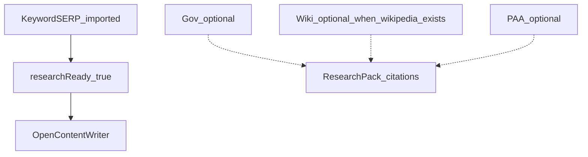

# Restore optional Wikipedia lane (no revert)

**Status:** Planned (forward fix on `684567a` — do not git revert)  
**Created:** 2026-07-03

## Problem

Commit `684567a` over-corrected:

- **Deleted** the wiki lane from the operator UI entirely
- **Hard-coded** `customer-journey` as the only topic with supplemental requirements (gov)

Runs are **not** limited to customer-journey (e.g. prospecting keyword + its own `research/<slug>/` folder). Wikipedia is a **valuable citation when available**, but must **never block** Content Writer when absent.

## What 684567a deleted (inventory)

This commit removed capability — it did not merely make wiki optional.

| Deleted | File / area | Impact |
|---------|-------------|--------|
| Wiki upload row | `MANUAL_RESEARCH_LANE_ORDER` — removed `'wiki'` | Operators cannot import Wikipedia SERPs at all |
| Wikipedia query hint | `manualResearchLaneQueryHint` wiki case | No guidance for `site:en.wikipedia.org` when results exist |
| Wiki file preflight | `validateManualLaneFileContent` wiki branch | No client-side rejection of `.wiki` TLD junk files |
| Wiki workflow gate | `ManualResearchReadiness` — removed wiki gate | No visibility into whether wiki was imported |
| Wiki in insights rail | `research-insights-rail.tsx` — removed from `MANUAL_LANES` | Content Writer UI doesn't show wiki lane status |
| Wiki citation copy | insights rail + lanes card | Text no longer mentions wiki as a citation source |
| Customer-journey-only framing | Replaced with gov-only for that slug | Wrong for non–customer-journey runs |
| Topic slug lock | *(kept removed — this was correct)* | Slug stays editable |

**Not deleted (still in repo):** backend wiki import API, `CitationLaneDomainRules`, `CitationLaneHtmlFallback`, `SerpResearchLanes.Wiki`, operator enricher `citations_wikipedia` bucket — all dormant without UI.

## What this plan restores vs keeps

| Restore | Keep deleted / changed |
|---------|------------------------|
| Wiki lane row in Site Analyzer | Wiki **required** for any topic |
| Wiki query hint + import preflight (on file pick) | Topic slug lock after imports |
| Wiki informational gate (non-blocking) | `customer-journey` as default slug |
| Wiki in insights rail (`na` when null) | Gov required for customer-journey only |
| Wikipedia null = valid skip state | Git revert of 684567a |
| Topic slug editable + auto from keyword | — |
| All supplemental lanes optional (keyword-only unlock) | — |

## Target behavior

| Lane | Required for Content Writer? | When to use |
|------|------------------------------|-------------|
| keyword | **Yes** | Always |
| gov, edu, local, paa | No | Import when you have saved SERPs |
| wiki | No | **Null/absent is valid.** Import only when `en.wikipedia.org` results exist; skip otherwise — not an error |

Wiki file validation stays **per-import only**: reject wrong files (`.wiki` TLD junk, no `wikipedia.org` URLs) when operator **chooses to import** a wiki file — does not gate Content Writer. **No import = null wiki lane = OK.**

## Wikipedia null semantics

**“Allow null”** means missing wiki data is a normal, successful state — not a failure, warning, or blocker.

| Layer | Null wiki behavior |
|-------|-------------------|
| **Content Writer gate** | `ManualResearchLanes` may omit wiki entirely; `ValidateManualResearchExport` passes without wiki |
| **researchReady** | Wiki gate incomplete does not block `researchReady` |
| **Export bundle** | No wiki entry in `manualResearchLanes` — citations from wiki simply absent |
| **Operator enricher** | `citations_wikipedia` query skipped when `HasNonEmptyManualLane(wiki)` is false |
| **UI wiki row** | Empty gate shows neutral **“Skip — no Wikipedia for this keyword”**, not red/amber error |
| **UI lane chips** | Wiki uses `na` status (gray/neutral), not `empty` (amber) when not imported |
| **Import attempt** | Still 422 if user uploads a **wrong** wiki file — that is a file error, not “null not allowed” |

**Do not** treat absent wiki like a failed required lane anywhere in workspace “Waiting on”, insights rail, or lane card footer.

## What we keep from 684567a

- Topic slug always editable (`ManualLaneImportService.cs` — no post-import lock)
- `pendingRequiredGateLabels` pattern in workspace (will show nothing once supplemental requirements are removed)
- Backend wiki import API, domain rules, HTML fallback — unchanged

## Implementation todos

1. **Remove customer-journey special casing** — `RequiredSupplementalLanes()` / `requiredManualLanesForTopic()` → `[]` for all topics (frontend + backend)
2. **Restore wiki lane UI** — `MANUAL_RESEARCH_LANE_ORDER`, hints, preflight on file pick; `na` chip when null
3. **Restore wiki informational gate** — `ManualResearchReadiness`; non-blocking
4. **Fix research topic slug** — editable; auto from keyword import; no `customer-journey` default; dirty-flag on `loadResearchFocus`
5. **Tests + build** — `ManualResearchLaneTests`; `dotnet test`; `npm run build`

## What we change (forward edits only)

### 1. Remove `customer-journey` special casing

**Backend** — return empty required supplemental lanes for **all** topics:

- `SiteAnalyzer2/.../ManualResearchReadiness.cs`: `RequiredSupplementalLanes()` → `[]`
- `GeekSeo.Application/.../ResearchBackedWriteGate.cs`: `ResolveRequiredSupplementalLanes()` → `[]`

**Frontend:**

- `frontend/src/lib/manual-research-lanes.ts`: `requiredManualLanesForTopic()` → always `[]`

Manual research unlock = **keyword organics present** (already enforced).

### 2. Restore wiki lane in UI (optional, null allowed)

`frontend/src/lib/manual-research-lanes.ts`:

- Add `'wiki'` back to `MANUAL_RESEARCH_LANE_ORDER`
- Restore `manualResearchLaneQueryHint` wiki case (`site:en.wikipedia.org` — guidance only)
- Restore `validateManualLaneFileContent` wiki checks **only when a file is selected for import**

`frontend/src/components/site-analyzer2/ManualResearchLanesCard.tsx`:

- Restore wiki row; neutral empty copy — *“Skip if Google has no en.wikipedia.org results”*

`frontend/src/components/content-writing/research-insights-rail.tsx`:

- Add `'wiki'` back to `MANUAL_LANES`; `na` status when not imported

### 3. Restore wiki as informational gate

`ManualResearchReadiness.cs`:

- Re-add: `new("wiki", "Wikipedia", stats.OrganicCount(Wiki) > 0)`
- `researchReady` = `hasKeywordSerp` only

`GeekSeoBackend.Tests/ManualResearchLaneTests.cs`:

- Export passes without wiki; passes with wiki when imported

### 4. Fix research topic slug

**Backend** (`KeywordWorkflowService.cs`):

- `POST /imports/keyword-page?topic=...` — operator slug
- If omitted — `ResearchTopicSlug.FromKeyword(keyword)`
- `PATCH /analysis-runs/{id}/topic-slug` — anytime

**Frontend** (`site-analyzer2-workspace.tsx`):

| When | Behavior |
|------|----------|
| Before keyword import | Slug editable; empty OK; pass `?topic=` only if typed |
| After keyword import | `body.topicSlug` or `slugifyResearchTopic(keyword)` |
| On blur (run exists) | PATCH topic slug |
| On loadResearchFocus | Sync server slug only when not dirty / not focused |
| localStorage | No `customer-journey` fallback; key by run id or clear stale |
| Defaults | Empty initial state; placeholder `auto-from-keyword` |

**Copy:** "Matches folder `research/<slug>/`. Leave blank to auto-derive from keyword on import; edit anytime."

### 5. Tests

- Keyword-only manual export passes
- Gov/wiki optional
- `dotnet test` + `npm run build`

## Deploy

Single new commit on `main` (no revert). Vercel auto-deploys frontend; SiteAnalyzer2 needs separate deploy for readiness/gate API.

## Out of scope

- Git revert of `684567a`
- Making wiki required for any topic
- Changing backend wiki domain validation (`en.wikipedia.org` only when importing wiki lane)
