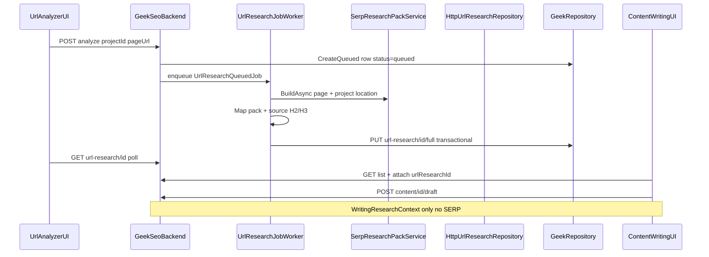

# Page URL Research (relational, shared DB)

## Feature boundary (read this first)

| | **URL Analyzer** | **Content Writing** |
|---|------------------|---------------------|
| **Owns** | Crawl, SERP, competitor pages, persist `seo_url_research_*` rows | Attach `url_research_id` → draft / score |
| **Multi-page crawl** | **In scope day one** — 1 source page + up to 5 SERP competitor crawls per analyze job | **Does not run crawls** — reads one completed row |
| **Never touches** | — | `site_research_id`, sitemap/BFS, analyze enqueue, live SERP at write time |

**One URL per enqueue** = one user-submitted page URL → one `seo_url_research` row. It does **not** mean a single HTTP crawl. The analyze job is multi-page by design.

**Site-wide batch** (sitemap/BFS, many user URLs in one enqueue) = **Phase 2** via optional `seo_site_research`.

---

**Status:** **Approved source of truth** — build and review against this doc. Backend largely coded (uncommitted); E2E blocked on GeekRepository + frontend cutover.  
**Last updated:** 2026-06-17

**Overview:** URL Analyzer enqueues page research (source crawl + SERP + competitor crawls) → rows in DB. Content Writing attaches `url_research_id` → draft via `WritingResearchContext` (**research path**), or legacy brief/outline when FK is null. No JSON handoff. No SERP at write time on the research path.

---

## What’s solid (build these)

- Forbidden-at-write list — enforce in code review
- `WritingResearchContext` + draft-only gates on the **research path** (`url_research_id` set)
- **Dual write path** — legacy brief/outline remains for docs without FK until cutover is complete
- Two-repo critical path + implementation order
- Slim child tables; deferred schema tables
- GBP-off / host rules / pinned keyword chain
- INSERT re-analyze + `supersedes_research_id`
- Keep in-memory pack + `PersistAsync`

---

## Approval status

| Area | Status |
|------|--------|
| Write pipeline design | **Approve** — if gates implemented literally |
| Analyze pipeline design | **Approve v1** — one URL per enqueue; source + competitor **multi-page crawl** day one |
| Content Writing scope | **Approve v1** — attach `url_research_id`; no crawl/analyze logic |
| Schema v1 | **Approve** — one `seo_url_research` parent row per enqueue; `seo_site_social_signal` deferred |
| Overall | **Approved** — this document is the single source of truth for v1 |

---

## Approval gates (write pipeline)

| Gate | Requirement |
|------|-------------|
| **Draft-only (research path)** | When `url_research_id` set: one action research → draft HTML. No brief/outline on that doc. |
| **`WritingResearchContext`** | Rows → `WritingResearchContext` → `ArticlePromptBuilder` / enrichers / scoring. **Never** `ContentBrief` on research path. |
| **Dual-path policy** | FK set → research path only. FK null → **legacy** brief → outline → draft (existing workers + UI). |
| **`ResearchBackedWriteGate`** | Single helper: if FK set, all write consumers use frozen research — never live SERP or `GenerateBriefAsync`. |
| **GeekRepository critical path** | Migration + **GeekRepository + GeekAPI deploy** before any persist works. |
| **Async analyze job** | POST enqueue only; **poll-only v1** (`GET url-research/{id}`); SignalR optional phase 2 |

---

## Forbidden at write time (non-negotiable)

For documents with `url_research_id`:

- No live SERP (`ISerpProvider`)
- No vendor cache reads (`seo_serp_results`, `ISerpCacheRepository`) — including `IContentScoringService` / `ContentScoringService` when `url_research_id` is set
- No `GenerateBriefAsync` / `ContentBriefService` SERP path
- No outline or brief generate API/UI **on the research path** (legacy FK-null docs unchanged)
- No “refresh SERP” from Content Writing
- No niche profile for writing input

**Scoring and prompts on the research path read `seo_url_research_*` only** (benchmarks/SERP features shipped; term coverage from keyword tokens until recommended-term scoring ships). Never `seo_serp_results` or live SERP.

Enforce via **`ResearchBackedWriteGate`** (Application): if `url_research_id` is set, all write consumers use frozen research; if FK is null, legacy `ContentBriefService` remains available.

---

## Dual write path (v1)

| Path | When | Input | Brief/outline? | Live SERP at write? |
|------|------|-------|----------------|---------------------|
| **Research-backed** | `url_research_id` set | `WritingResearchContext` | **No** — draft-only | **Forbidden** |
| **Legacy** | `url_research_id` null | `ContentBrief` via `GenerateBriefAsync` | **Yes** | Allowed (existing) |

- **New Content Writing flow (recommended):** create doc → attach research → draft-only.
- Once `url_research_id` is set, that document uses the research path only (no revert in UI v1).
- **Bulk/full-article workers** keep `GenerateBriefAsync` until Phase 2 (see pipeline matrix).

### Pipeline matrix (v1 — no silent breakage)

| Entry point | `url_research_id` | Input at write time | Brief/outline? | Live SERP? |
|-------------|-------------------|---------------------|----------------|------------|
| `POST /api/seo/content` with `urlResearchId` | **Set at create** | Same attach contract as PATCH | No | **Forbidden** |
| `PATCH /api/seo/content/{id}/url-research` | **Set** | Validates then sets FK; copies keyword/location if empty | No | **Forbidden** |
| Content Writing — research draft | **Required** | `WritingResearchContext` | No | **Forbidden** |
| Content Writing — score | Set → research path | Frozen rows (benchmarks/SERP features); term score = keyword tokens | N/A | **Forbidden** |
| Content Writing — auto-optimize | Set → research path | Same as score | N/A | **Forbidden** |
| Content Writing — render/schema | Set → research path | Project + `WritingResearchContext` | N/A | **Forbidden** |
| Content Writing — competitor insights | Set → research path | Frozen competitor rows | N/A | **Forbidden** (no live crawl refresh) |
| Content Writing — legacy doc | **Null** | `ContentBrief` via `GenerateBriefAsync` | Yes | Allowed (unchanged) |
| `FullArticleJobWorker` | **Null** (v1) | `GenerateBriefAsync` | Yes | Allowed — unchanged until Phase 2 |
| `BulkArticleJobWorker` | **Null** (v1) | `GenerateBriefAsync` | Yes | Allowed — unchanged until Phase 2 |
| `ArticleGenerationPipeline` | **Null** (v1) | `GenerateBriefAsync` | Yes | Allowed — unchanged until Phase 2 |

**Phase 2:** migrate bulk/full-article to require pre-analyzed `url_research_id` or explicit legacy opt-in.

### Legacy document policy (cutover)

| Doc age | Policy |
|---------|--------|
| **New docs** (Content Writing v1 UI) | Must attach `url_research_id` before research draft. No brief/outline on create. |
| **Existing docs** (`url_research_id` null) | **Grace period:** keep brief → outline → draft → review. No forced backfill. |
| **Attach research to existing doc** | One-way: FK set → research path only; brief/outline UI hidden for that doc. |
| **Research deleted** | FK `ON DELETE SET NULL` → doc falls back to legacy path (edge case; avoid in UX). |

There is **no** overnight hard block on all existing `seo_content_documents` rows. Hard block applies only to the **new research draft** endpoint and UI.

---

## Write path (research-backed docs only)

| Instead of | Do |
|------------|-----|
| `ContentBrief` / `UrlResearchMapper` | `WritingResearchContext` from `GET url-research/{id}` |
| Outline + draft (user steps) | **Draft only** — internal section plan inside draft call if needed |
| Deprecate brief/outline globally | **Remove** from research-path API/UI only; legacy path unchanged until zero callers |

Four-phase methodology: woven **inside draft prompt** from `section_hint` + competitor headings — not a product step. **Blocking:** update [`content-writing-prompt.md`](./content-writing-prompt.md) in the same PR as step 4 (draft endpoint) — draft-only behavior depends on it.

---

## `WritingResearchContext` (single read DTO — no parallel shapes)

One type in `GeekSeo.Application` — built from `GET url-research/{id}` / `GetFullAsync`. **Do not** add parallel DTOs for prompt, score, and enrichers.

| Property | Source |
|----------|--------|
| `UrlResearchId` | `seo_url_research.id` |
| `ProjectId`, `UserId` | parent row |
| `SourceUrl` | `source_url` |
| `DerivedKeyword` | `derived_keyword` |
| `SearchLocation` | `search_location` |
| `BusinessContext` | `business_context` |
| `IntentPrimary`, `IntentJustification` | parent columns |
| `Paf` (type, format, text, sourceUrl, beatStrategy) | `paf_*` columns |
| `DirectAnswerInstruction`, `MustBeatPaf` | `direct_answer_*` |
| `Benchmarks` (median words, title length, h2 count, dominant format) | parent benchmark columns |
| `DataQuality`, `DataQualityNotes` | `data_quality`, `data_quality_notes` — **`partial` is data quality, not job `status`** |
| `ResearchedAt` | `researched_at` |
| `Organic` | `seo_url_research_organic` rows |
| `PeopleAlsoAsk` | `seo_url_research_paa` rows |
| `RelatedSearches` (PASF) | `seo_url_research_pasf` rows |
| `Competitors` (url, position, headings[]) | `competitor` + `competitor_heading` |
| `SourceHeadings` (level, text) | `seo_url_research_source_heading` — **this page’s** H2/H3 |
| `RecommendedTerms` | `seo_url_research_term` rows |
| `ClosingFaqs` | `seo_url_research_closing_faq` rows |
| `SectionHints` (order, `Movement`, `Label`, `SuggestedH2`, `SubtopicsFromSerp[]`) | `seo_url_research_section_hint` rows — prompts use `SuggestedH2` only, not `Label`/`Movement` |

Consumers: `ArticlePromptBuilder`, `ArticleClosingFaqEnricher`, `ContentScoringService`, draft endpoint — all take `WritingResearchContext`.

---

## v1 analyze scope (pinned — stops scope creep)

| Question | v1 answer |
|----------|-----------|
| What does the user type? | **One page URL** (e.g. `https://example.com/blog/my-post`) |
| How many `seo_url_research` rows per enqueue? | **Exactly 1** |
| Multi-page crawling in the job? | **Yes, day one** — 1 source page crawl + up to **5** SERP competitor crawls (`CompetitorCrawlService`, max 3 concurrent) |
| What is `seo_site_research`? | **Optional** parent for **Phase 2** site batch; v1 may omit or leave null |
| Site-wide crawl / sitemap / BFS? | **Phase 2** — many user pages in one enqueue, explicit max pages, cost caps, page picker UX |
| Content Writing picker? | Lists **`seo_url_research` rows** for project (`source_url`, keyword, `researched_at`, `data_quality`) — one row per past analyze of that page URL |

**Phase 2 (not v1):** site batch enqueue (`POST /api/seo/site-research/analyze`), sitemap discovery, per-run page cap (e.g. 50), aggregate progress UI.

---

## Naming (one noun, one API prefix)

| Layer | v1 name |
|-------|---------|
| User-facing | **Page research** — “Analyze this page URL” |
| Doc / tables | `seo_url_research` (+ children); `seo_site_research` deferred/optional |
| Job type | `url_research` |
| Analyze pipeline | `UrlResearchAnalyzeService` + `SerpResearchPackService.BuildAsync` |
| Repo auth façade | `UrlResearchService` (GeekRepository access control only) |
| API prefix | `/api/seo/url-research/*` |

| Method | Route | Purpose |
|--------|-------|---------|
| `POST` | `/api/seo/url-research/analyze` | `{ projectId, pageUrl }` → enqueue → `{ urlResearchId, status: "queued" }` |
| `GET` | `/api/seo/url-research/{id}` | Full graph as `SeoUrlResearch` entity — **403** if caller lacks project access. Map to `WritingResearchContext` in app layer (draft/score); frontend may use summary list + attach or a thin client mapper. |
| `GET` | `/api/seo/url-research?projectId=` | Picker list — **scoped to `projectId`** |

Future multi-page: `POST /api/seo/site-research/analyze` — **not in v1**.

### Project on analyze (required)

Analyze **requires `projectId`**. v1 UX:

- **Route:** `/projects/{projectId}/url-analyzer` (preferred), or global `/url-analyzer` with **project picker** (same pattern as Content Writing).
- **POST body:** `{ projectId, pageUrl }` — never analyze without project context.
- **Host check:** page URL registrable domain must match `SeoProject.Url` for that `projectId` (see derivation chain).
- **No auto-match** across projects in v1 — user must be in the correct project.

Without `projectId`, `search_location`, ownership columns, host rules, and the research picker cannot work.

---

## Glossary

| Abbrev | Full name |
|--------|-----------|
| **GMB** | Google My Business |
| **GBP** | Google Business Profile (current name; same as GMB) |
| **PAF** | Primary Answer Feature |
| **PAA** | People Also Ask |
| **PASF** | People Also Search For |
| **JSON-LD** | JSON Linked Data |

---

## Implementation checklist

### Critical path — two repos

- [x] **1a.** EF migration — `seo_url_research` + v1 children (`GeekSeo.Persistence`) — `20260617190112_AddUrlResearchTables`
- [ ] **1b.** GeekRepository handlers — `POST .../queued`, `PUT .../{id}/full` (transactional), `GET .../{id}/full`, list, `PATCH .../status`, stale-running maintenance — **blocker; deploy before prod persist**
- [x] **1c.** `HttpUrlResearchRepository` in GeekSeoBackend
- [x] **1d.** Async job — `UrlResearchJobChannel`, `UrlResearchJobWorker`, `UrlResearchController` analyze/poll/list; **poll-only v1** (persist blocked until 1b)

### Analyze (v1 = one user URL per enqueue)

- [x] `UrlResearchAnalyzeService` + `UrlResearchPackMapper` + source H2/H3 in `SerpResearchPackService`
- [ ] **Max 1 user URL per enqueue**; reject site-batch in v1 (competitor multi-crawl is in-scope)
- [ ] Reuse `seo_serp_results` vendor cache during analyze only
- [x] `RegistrableDomainMatcher` + unit tests (`RegistrableDomainMatcherTests`)
- [x] `UrlPageKeywordResolver` (meta title → H1 → slug; **no** og:title/breadcrumb in v1)
- [x] `UrlResearchQueuedJob` payload — `{ urlResearchId, projectId, userId, sourceUrl }` only; worker resolves location/keyword from project + crawl (never `UrlAnalyzerResearchRequest` in worker path)
- [ ] Pin remaining derivation rules (below)

### Write (approved gates)

- [x] `seo_content_documents.url_research_id` FK — `20260617190112_AddUrlResearchTables` (`ON DELETE SET NULL`)
- [x] **`WritingResearchContext`** + `WritingResearchContextMapper` + `ResearchBackedWriteGate`
- [x] `POST /api/seo/content/{id}/draft` + `PATCH .../url-research` attach (`ContentResearchWritingService`)
- [x] **Enrichers + render:** `ArticlePromptBuilder`, `ArticleClosingFaqEnricher`, `ArticleRenderService` research branches — no `GenerateBriefAsync` when FK set
- [x] Attach contract on create + PATCH — `ValidateResearchForProject` (`AttachContractTests`)
- [ ] **Research-path term scoring:** `ContentScoringService` still uses keyword token split only — not `RecommendedTerms` (see Score semantics)
- [x] **Forbidden-at-write tests** — `ContentScoringForbiddenTests`
- [ ] Stale research UX (banner when newer row exists)

### Quality, cost, tests

- [x] **`data_quality` pipeline (shipped)** — `ResolveDataQuality` → `MapDataQuality` (see shipped table in schema section)
- [ ] **data_quality target rubric** (PAA, crawl-fail) — optional hardening, not shipped
- [ ] **Vendor caps v1:** documented; verify in worker
- [x] **Usage metering:** `MeteredRoutes` — `POST /api/seo/url-research/analyze` → `url_research_analyze`
- [ ] **Re-draft + score suggestions:** out of scope v1
- [x] **Tests exist:** `WritingResearchContextMapperTests`, `RegistrableDomainMatcherTests`, `UrlPageKeywordResolverTests`, `UrlPageBusinessContextResolverTests`, `SerpResearchPackServiceTests`, **`AttachContractTests`**
- [ ] **Tests missing:** `UrlResearchPackMapperTests`, `UrlResearchJobWorkerTests`, `ContentScoringForbiddenTests`

### UI

- [ ] URL Analyzer: page URL → enqueue → poll → show row in list
- [ ] Content Writing: project picker → **page research list** → attach → draft → edit → score
- [ ] **Cutover:** remove sync `POST api/seo/url-analyzer/research` + JSON export + location field when async UI ships
- [ ] **Content Writing UI:** dual mode — research-attached docs draft-only; FK-null docs keep legacy brief | outline | draft | review
- [ ] **Research-path gate:** new docs without `url_research_id` cannot use **research draft** — UI: *“Attach page research from URL Analyzer first.”*

---

## Architecture (v1)

```
POST /url-research/analyze { projectId, pageUrl }
  → enqueue url_research job
  → worker: crawl source page → SERP → crawl top competitors (multi-page) → PersistAsync
  → GET /url-research/{id} when status = completed

Content Writing
  → pick url_research_id from list
  → WritingResearchContext
  → POST .../draft
  → edit → score (seo_url_research_* only)
```

---

## Derivation chain (pinned)

### GBP / GMB off (most projects today)

Analyze and draft **proceed**. `business_context` from crawl meta/JSON-LD, project name, `BusinessAddress`, `DefaultLocation`. `gbp_source = none`. No GBP API required.

### Host vs project URL

**v1 rule — registrable domain match (not strict host equality):**

- Normalize apex: `www.example.com` ↔ `example.com` → **allow**
- `blog.example.com` with project `example.com` → **allow** if same registrable domain
- `client.com` inside `agency.com` project → **reject** 400 with explicit message: *“Page URL must be on the same domain as the project.”*

UI: show project domain on analyze form so subdomain cases are expected, not silent 400s.

### `derived_keyword` (not H2–H6)

1. Meta title segment (before `|`, `-`, etc.)
2. If generic → H1
3. URL slug → Title Case
4. ~~`og:title`, breadcrumb~~ — **deferred past v1** (resolver implements meta title → H1 → slug only)

Competitor **H2–H3** → `seo_url_research_competitor_heading` only (structure benchmark).

### Search location

`DefaultLocation` → geocode `BusinessAddress` → national fallback.

---

## Schema v1

### `seo_url_research` (single parent — v1)

`id`, `project_id`, `user_id`, `source_url`, `derived_keyword`, `search_location`, `business_context`, `gbp_source`, `status` (`queued` \| `running` \| `completed` \| `failed`), `error_message`, `data_quality` (`full` \| `partial` \| `weak`), `data_quality_notes`, intent + PAF + benchmark columns, `researched_at`, `supersedes_research_id`, `site_research_id` (**always null in v1**; column optional in migration)

### Children v1

| Table | Draft/score consumer |
|-------|-------------------|
| `seo_url_research_organic` | SERP context in prompt |
| `seo_url_research_paa` | FAQ + subtopics |
| `seo_url_research_pasf` | Terms + angles |
| `seo_url_research_competitor` + `competitor_heading` | Competitor structure in prompt |
| `seo_url_research_source_heading` | **Source page** H2/H3 — match/fix outline for `source_url` |
| `seo_url_research_term` | **Scoring** term coverage |
| `seo_url_research_closing_faq` | **ArticleClosingFaqEnricher** |
| `seo_url_research_section_hint` | Draft section intents |

### Deferred (v1)

- `seo_site_research` as required parent (optional/null FK only)
- `seo_url_research_serp_feature`, `page_schema`, `competitor_schema`
- **`seo_site_social_signal`** — not read by draft/score v1; fold into `business_context` string at analyze time if `sameAs` found, or defer entirely

### Re-analyze

Always **INSERT** new row; `supersedes_research_id` → prior id. Documents keep old FK until user attaches newer row.

### `data_quality` — shipped behavior (code today)

Set in `SerpResearchPackService.ResolveDataQuality`, then `UrlResearchPackMapper.MapDataQuality`:

| Pack value | DB value | When (code) |
|------------|----------|-------------|
| `live` | `full` | SERP has organics **and** ≥3 competitor pages crawled |
| `partial` | `partial` | SERP organics present but &lt;3 competitors crawled, **or** ≥5 organics with limited depth |
| `unavailable` | `weak` | Zero SERP organic results |

Notes accumulate in `data_quality_notes`. **No PAA check.** Failed jobs (`status=failed`) get no quality label.

### `data_quality` — target rubric (optional hardening, not shipped)

| Value | Target when | Attach? | Draft? |
|-------|-------------|---------|--------|
| `full` | Source crawl ok + SERP ok + ≥3 competitors + PAA present | Yes | Yes |
| `partial` | Completed with gaps (empty PAA, thin headings) | Yes | Yes + banner |
| `weak` | SERP fetch failed **or** source crawl failed but partial pack salvaged | Yes | Yes + banner |
| *(none)* | `status=failed` | No | No |

Implement in `ResolveDataQuality` / mapper when product wants stricter labels — until then, **ship table above** is truth.

### Weak research product rule

**Partial and weak allowed for attach/draft in v1.** UI warns (banner). Draft prompt includes `data_quality_notes`. Do not block attach or draft for empty PAA/PASF in v1.

### Attach contract

Applies to **`PATCH .../url-research`** and **`POST /api/seo/content` when `urlResearchId` is set** — enforced in `ResearchBackedWriteGate.ValidateResearchForProject` (used by `ContentResearchWritingService` + `ContentDocumentService.CreateAsync`).

| Rule | Enforcement |
|------|-------------|
| `urlResearch.project_id === document.project_id` | **400** if mismatch |
| Research `status` | Must be `completed` (reject `queued`/`running`/`failed`) |
| `data_quality` | `partial`/`weak` allowed — warn only |
| User access | `UrlResearchService` / GeekRepository **403** if JWT user lacks project |
| Keyword/location on create | If client omits or sends default US location, copy `derived_keyword` + `search_location` from research row |
| One-way | Once FK set, no UI revert to legacy brief/outline |

### Stale research UX

When `supersedes_research_id` chain has a newer `completed` row for the same `source_url`:

- Picker sorts by `researched_at` desc (newest first).
- If attached doc points at an older row: read-only banner *“Newer research available”* + link to re-attach (no auto-swap).
- Re-analyze always **INSERT**; user explicitly picks newer row.

### Score semantics (research path — shipped vs target)

**Shipped today:**

| Component | Source when FK set |
|-----------|-------------------|
| Benchmarks (word count, title length, organic list) | `WritingResearchBenchmarkResolver` → frozen `seo_url_research_*` |
| SERP feature guidance | `WritingResearchBenchmarkResolver.ToSerpFeatures` from research |
| Term coverage (35 pts max) | **`ScoreTermCoverage` from `seo_url_research_term` rows** (falls back to keyword tokens when empty) |
| PAA alignment in score | **Not scored** — PAA used in draft/enrichers only |

**Target (not shipped):** term coverage from `seo_url_research_term` rows; optional PAA coverage sub-score.

UI copy (when implemented): *“Score reflects your draft against research captured on {researched_at}. Term coverage uses the page keyword until recommended-term scoring ships.”*

### Auto-optimize (research path)

`AutoOptimizeAsync` stays enabled when `url_research_id` is set. It re-scores via the same frozen rows and applies suggestions — **never** calls `ISerpProvider` or `ISerpCacheRepository`. Same `ResearchBackedWriteGate` as score.

### Usage metering (analyze) — not implemented

Each enqueue = 1 SERP + 1 source crawl + up to 5 competitor crawls. **Shipped:** `POST /api/seo/url-research/analyze` → `url_research_analyze` in `MeteredRoutes` / `UsageLimits` (Starter 5/mo, Professional 20, Team 60, Agency unlimited).

### Optimize existing page vs net-new content

v1 supports **both**:

| Workflow | How |
|----------|-----|
| **Refresh existing URL** | Analyze project's own `source_url` → attach → draft uses `SourceHeadings` to match/fix page structure |
| **Net-new article** | Analyze a target URL or competitor-style URL on project domain → attach → draft uses competitor headings + section hints |

Same pipeline; UI labels picker row with `source_url` so intent is clear.

---

## Two sources of truth

| Store | Role |
|-------|------|
| `seo_serp_results` | Vendor cache **during analyze only** |
| `seo_url_research_*` | Draft, score, audit |

---

## Analyze pipeline

1. `SerpResearchPackService.BuildAsync` → in-memory `SerpResearchPack`
2. `UrlResearchPackMapper` → `UrlResearchFullWrite`
3. `PersistFullAsync` → **`PUT api/seo/internal/url-research/{id}/full`** (single transactional upsert)

---

## GeekRepository critical path

```
GeekSeo.Persistence (migration)
        ↓
GeekRepository + GeekAPI deploy  ← NOT DONE until this ships
        ↓
HttpUrlResearchRepository
```

Routes: `api/seo/internal/url-research` (match `api/seo/internal/content` convention).

**Auth:** all read/write endpoints enforce `user_id` + `project_id` ownership — **403** if JWT user cannot access project.

**Persist contract:** `PUT api/seo/internal/url-research/{id}/full` — body = parent + child arrays; GeekRepository replaces children in one transaction; rollback on any child failure.

### Enqueue lifecycle (pinned)

1. **POST analyze** → INSERT `seo_url_research` with `status=queued` → return `{ urlResearchId, status: "queued" }` → enqueue `UrlResearchQueuedJob`
2. Worker → claim / PATCH `status=running`
3. Worker → `BuildAsync` (SERP via `seo_serp_results` cache key = keyword+location) → `PUT .../{id}/full` (transactional, idempotent replace)
4. Success → PATCH `status=completed`, set `researched_at`, `data_quality` per **shipped** rubric
5. Failure → PATCH `status=failed`, `error_message` — **no orphan child rows**

### Job lifecycle edge cases

| Case | v1 behavior |
|------|-------------|
| **Duplicate enqueue** (same `pageUrl` twice) | Allowed — two `queued` rows (INSERT re-analyze). Picker shows both; UI may debounce double-click on enqueue button. |
| **Worker crash after SERP spend, before persist** | Retry reuses `seo_serp_results` vendor cache (keyword+location); no duplicate vendor spend if cache hit. |
| **Stuck `running`** | Worker startup: `FailStaleRunningAsync` after **15 min** → `failed` + `error_message`. Job timeout **15 min**. |
| **Poll UX** | Client polls `GET /{id}` every **2–3s**; show `queued`/`running`/`failed`/`completed`; max poll **15 min** then show timeout CTA (re-enqueue). |
| **`PUT /full` retry** | Idempotent — replaces all children in one transaction; safe on worker retry after partial write failure. |

**Canonical persist verb:** `PUT api/seo/internal/url-research/{id}/full` (not POST).

### API response shapes

| Endpoint | Returns |
|----------|---------|
| `GET ?projectId=` | **Summary list** — id, source_url, derived_keyword, status, data_quality, researched_at (no children) |
| `GET /{id}` | Full graph as `SeoUrlResearch` entity (includes child collections). Map to `WritingResearchContext` in Application layer for draft/score. |

### Source headings in builder

`SerpResearchPackService` extracts H2/H3 from the **source page crawl** into `SourceHeadings` before `UrlResearchPackMapper` → `seo_url_research_source_heading`. Not copied from competitor crawl.

### Registrable domain match

**Done:** `RegistrableDomainMatcher` — normalize apex (`www.` strip), compare registrable suffix. Used in analyze host check; covered by `RegistrableDomainMatcherTests`.

### GeekRepository internal contract (GeekBackend — blocker)

Base path: `api/seo/internal/url-research`. All routes require `?userId=` and enforce project ownership (**403** on mismatch).

| Method | Route | Purpose |
|--------|-------|---------|
| `POST` | `/queued` | Body: `{ projectId, sourceUrl, supersedesResearchId? }` → parent row `status=queued` |
| `PUT` | `/{id}/full` | Body: `UrlResearchFullWrite` (parent fields + child arrays). **Transactional** delete/reinsert children; idempotent on worker retry |
| `GET` | `/{id}/full` | Full `SeoUrlResearch` graph with children |
| `GET` | `/` | Query: `projectId` → summary list (`UrlResearchSummary[]`, no children) |
| `PATCH` | `/{id}/status` | Body: `{ status, errorMessage?, researchedAt? }` |
| `GET` | `/maintenance/queued` | Query: `limit` → `UrlResearchQueuedJob[]` for worker drain |
| `POST` | `/maintenance/fail-stale-running` | Query: `maxAgeMinutes` → mark stuck `running` rows `failed` |
| `PATCH` | `/maintenance/{id}/claim-running` | Optimistic claim; **409** if already claimed |

**Content document attach (GeekRepository):** `PATCH api/seo/internal/content/{id}/url-research` sets `url_research_id` only. Attach validation runs in GeekSeoBackend Application layer before this call.

Host validation at analyze enqueue (GeekSeoBackend): `RegistrableDomainMatcher.SameRegistrableDomain(pageUrl, project.Url)` → **400** if mismatch.

---

## Content Writing UX (v1)

**Dual mode** — path depends on `url_research_id`:

| Mode | Flow |
|------|------|
| **Research-backed** (`url_research_id` set) | Select project → attach page research → **Generate draft** → edit → score. No brief/outline steps. |
| **Legacy** (FK null) | Existing **brief → outline → draft → review** unchanged. |

Research path read-only fields from `GET url-research/{id}` (or doc after attach). Stale-research banner when a newer `completed` row exists for same `source_url`.

**Not in Content Writing:** site crawl controls, analyze enqueue, `site_research_id` filtering. Those live on URL Analyzer only.

---

## Out of scope

### Content Writing (period)

- Any crawl (source, competitor, sitemap, BFS)
- Analyze enqueue or poll UX
- `seo_site_research` / `site_research_id` in picker

Content Writing **only** attaches `url_research_id` and reads frozen page rows.

### URL Analyzer / platform (deferred to Phase 2)

- Site-wide batch / sitemap crawl (`seo_site_research` parent with `page_count > 1`)
- `seo_site_social_signal` table (optional: merge LinkedIn/Facebook into `business_context` text at analyze)
- Re-draft with unapplied score suggestions (phase 2)
- `competitor_schema`, `page_schema`, `serp_feature` tables

---

## Route & UI cutover (from live code)

| Today | v1 |
|-------|-----|
| `POST api/seo/url-analyzer/research` — sync, returns full JSON pack | **Remove** after cutover |
| [`UrlAnalyzerController`](../GeekSeoBackend/Controllers/Seo/UrlAnalyzerController.cs) | Replace with `UrlResearchController` under `api/seo/url-research` |
| [`/url-analyzer`](../frontend/src/app/url-analyzer/page.tsx) — URL + manual **location** | Project picker + **page URL only**; route `/projects/{id}/url-analyzer` |
| JSON copy/download on analyzer page | Remove |

No coexistence period — delete sync endpoint when async path ships.

---

## Deploy coordination

**Deploy order (no extra env var):** ship GeekRepository `PUT .../full` before exposing analyze in prod. If persist is missing, the worker marks the job `failed` with the repo error — analyze enqueue is not gated separately.

**`content-writing-prompt.md`:** still describes brief/SERP-first flow — **not updated** for research-backed draft. Blocking for prompt parity; draft code uses `ArticlePromptBuilder` research overload today.

## Implementation order

1. Migration + entities — **done**
2. **GeekRepository + GeekAPI deploy** — `PUT .../{id}/full` + maintenance endpoints (**blocker** — nothing persists E2E)
3. HTTP repo + worker + controller — **coded**; E2E after step 2
4. Write path — **coded** (`WritingResearchContext`, draft, attach, gate, render); **gaps:** term scoring, forbidden-at-write **tests**, `content-writing-prompt.md`
5. **Ship gate:** GeekRepository `PUT .../full` + `MeteredRoutes` analyze entry — **before prod analyze**
6. **URL Analyzer UI** — still sync `url-analyzer/research` + location + JSON copy (**user-visible milestone**)
7. **Content Writing UI** — still brief/outline flow; no research attach/draft UI
8. Cutover: remove sync analyzer + research-path brief/outline UI; legacy FK-null unchanged
9. Tests: write missing test classes; pack round-trip after GeekRepository live

---

## Implementation status

**North star:** One page URL in → rows in DB → attach → draft → score. No JSON export, no brief/outline on the **research path**, no live SERP at write time.

### Honest grades

| Dimension | Grade | Notes |
|-----------|-------|-------|
| Architecture / direction | A | Frozen research at write time is right |
| Scope control | A | Feature boundary + Phase 2 deferrals hold |
| Backend executability | B+ | Analyze + write path largely coded; blocked on GeekRepository |
| Frontend / cutover | F | No UI change yet; sync analyzer still live |
| Doc accuracy (this file) | B | Synced to code 2026-06-17; score/data_quality split shipped vs target |
| Test contract | D | Plan-named tests mostly missing; mapper/gate tests not written |

### Coded vs E2E-proven

| Area | Coded in Geek-SEO | E2E-proven |
|------|-------------------|------------|
| Migration + entities | Yes | N/A |
| `HttpUrlResearchRepository` | Yes | No — GeekRepository missing |
| Worker + `UrlResearchController` | Yes | No — persist fails |
| `WritingResearchContext` + draft/attach | Yes | No integration tests |
| `ResearchBackedWriteGate` + scoring benchmarks | Yes | Term scoring gap; no forbidden-at-write tests |
| `ArticleRenderService` research path | Yes | No tests |
| Attach contract (project + completed) | Yes | No `AttachContractTests` |
| Usage metering (analyze) | **Yes** | GeekSeoBackend |
| URL Analyzer frontend | **No** | Sync path still |
| Content Writing frontend | **No** | Legacy stages still |
| `content-writing-prompt.md` | **No** | Still brief-centric |

### Current state vs plan

| Plan item | Actual state |
|-----------|--------------|
| GeekRepository `PUT .../full` | **Not done** — blocker |
| `WritingResearchContext` + mapper | **Done** |
| `POST content/{id}/draft` + attach | **Done** |
| `ResearchBackedWriteGate` | **Done** |
| Scoring benchmarks from research | **Done** |
| Scoring term coverage from `seo_url_research_term` | **Done** |
| `data_quality` target rubric (PAA, crawl-fail) | **Not done** — shipped rubric is organic/competitor depth only |
| Forbidden-at-write tests | **Done** |
| `MeteredRoutes` analyze | **Done** |
| Frontend URL Analyzer | **Partial** — async `UrlAnalyzerWorkspace` (poll/list) |
| Frontend Content Writing | **Partial** — research attach + draft path; legacy brief/outline for FK-null docs |
| Sync `UrlAnalyzerController` | **Removed** — `UrlResearchController` only |

### Sequence (E2E)



### Write-path deliverables (step 4 — same PR)

- `WritingResearchContext` + `WritingResearchContextMapper.FromEntity`
- `ResearchBackedWriteGate` — draft, score, render, auto-optimize
- `POST /api/seo/content/{id}/draft` — requires FK; attach validates project match + `status=completed`
- `ArticlePromptBuilder`, `ArticleClosingFaqEnricher`, `ArticleMethodologyDraftEnricher`, `AIWritingService.GenerateDraftFromResearchAsync`
- **Do not** remove `BriefsController` / outline routes globally — legacy FK-null docs + bulk workers still use them

### Tests

| Test | Status | Assert |
|------|--------|--------|
| `WritingResearchContextMapperTests` | **Exists** | Entity → DTO |
| `RegistrableDomainMatcherTests` | **Exists** | Host rules |
| `UrlPageKeywordResolverTests` | **Exists** | Keyword chain |
| `UrlPageBusinessContextResolverTests` | **Exists** | Business context |
| `SerpResearchPackServiceTests` | **Exists** | Analyze engine |
| `UrlResearchPackMapperTests` | **Missing** | Pack → `UrlResearchFullWrite`; `MapDataQuality` |
| `UrlResearchJobWorkerTests` | **Missing** | failed persist → `status=failed` |
| `ContentScoringForbiddenTests` | **Missing** | FK set → `ISerpProvider` never called |
| `AttachContractTests` | **Exists** | cross-project + incomplete create/attach → 400 |

### Execution backlog (code — not spec)

1. GeekRepository contract above — **blocker**
2. GeekRepository `PUT .../full` (blocker for E2E persist)
3. ~~`MeteredRoutes` entry for `POST /api/seo/url-research/analyze`~~ **done**
4. Frontend URL Analyzer + Content Writing cutover
5. `ContentScoringForbiddenTests`, `UrlResearchPackMapperTests`, `UrlResearchJobWorkerTests`
6. Optional: research-path term scoring from `seo_url_research_term`

### Risk register

| Risk | Mitigation |
|------|------------|
| GeekBackend deploy lag | Deploy GeekRepository `PUT .../full` before prod analyze; worker fails jobs if persist missing |
| Analyze without metering | ~~Add `MeteredRoutes` entry~~ **done** |
| Users see broken queued jobs | Deploy GeekRepository before enabling analyze in prod; jobs surface `failed` + error_message |
| Bulk workers break on "remove brief" | Pipeline matrix: workers unchanged in v1 |
| Legacy docs blocked overnight | Grace period: FK-null keeps brief/outline |
| Scoring leaks SERP on new path | Forbidden-at-write in **same PR** as draft endpoint |
| `BuildAsync` location drift | Worker-only `UrlResearchQueuedJob`; no manual location in public API |
| Movement labels in prompts | Prompt uses `SuggestedH2` only; test for no "Movement" in prompt text |

---

## Related docs

- [`content-writing-prompt.md`](./content-writing-prompt.md) — **not updated** for research path; still brief/SERP-first
- [`CONTENT-WRITING-IMPROVEMENT-PLAN.md`](./CONTENT-WRITING-IMPROVEMENT-PLAN.md) — draft-only rewrite
- [`SERP-RESEARCH-AGENT-PROMPT.md`](./SERP-RESEARCH-AGENT-PROMPT.md)
- [`LOCAL-GBP-INTEGRATION.md`](./LOCAL-GBP-INTEGRATION.md)
- [`GeekSeoBackend/HttpClients/Repo/CLAUDE.md`](../GeekSeoBackend/HttpClients/Repo/CLAUDE.md)
